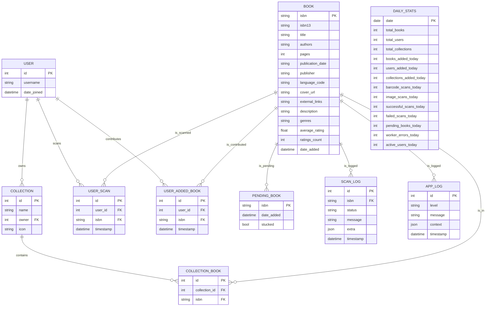
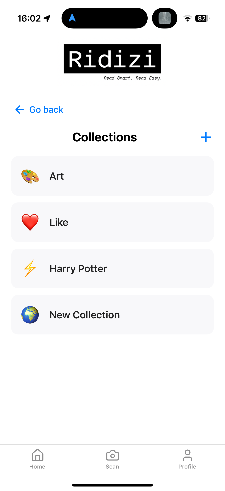
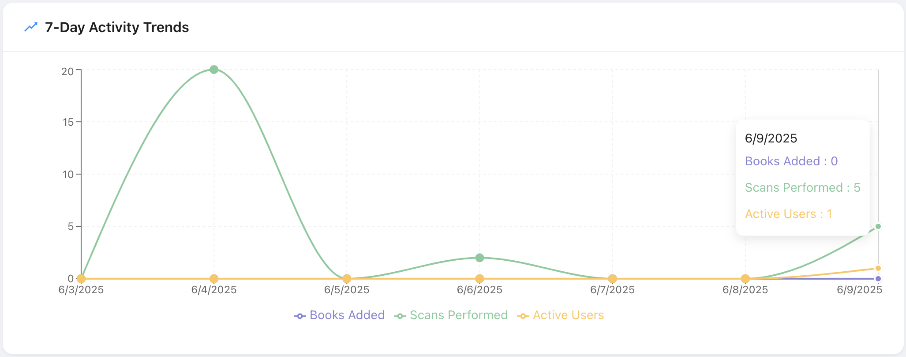

<div align="center">


---

# Final Report

**Title:** Ridizi – Moonshot Project

**Author:** Pierre GORIN

**Created on:** May 27<sup>th</sup>, 2025 

**Last updated:** June 9<sup>th</sup>, 2025

</div>

<br><details>

<summary><strong>Table of Contents (Click to expand)</strong></summary>

- [Final Report](#final-report)
  - [1. Introduction](#1-introduction)
  - [2. Functional Specifications](#2-functional-specifications)
  - [3. Technical Specifications](#3-technical-specifications)
  - [4. Test Plan](#4-test-plan)
  - [5. Screenshots](#5-screenshots)
  - [6. Management](#6-management)
  - [7. End Matter](#7-end-matter)

</details>

---

# 1. Introduction

This document serves as the official report for the Ridizi project. It outlines the project’s purpose, design, development process, and technical implementation. It is intended to provide a clear and structured overview of the work carried out.

## 1.1. Project Description

**Ridizi** is a mobile application that enables users to scan the **cover of a book** and instantly access rich, structured metadata such as title, author, summary, genre, price, and publication date.

The goal of Ridizi is to make book recognition **fast, effortless, and visually intuitive**. The app is particularly useful for readers who want to catalog personal collections, track their reading history, or discover new books through visual scanning—without any typing or search forms.

When a book is not recognized, the user can optionally scan the **barcode** to contribute that book to the database.

## Built With

| Technology                                                                                                                                                                                                                                                                                          | Description                                                  |
| --------------------------------------------------------------------------------------------------------------------------------------------------------------------------------------------------------------------------------------------------------------------------------------------------- | ------------------------------------------------------------ |
|                                                                                                                                                                       | Used to build the cross-platform mobile application.         |
|                                                                                                                                                                                    | For all frontend and backend logic.                          |
|                                                                                                                                                                                                      | To simplify mobile app development and testing.              |
|                                                                                                                                                                                                | Used for the backend API and AI services.                    |
|                                                                                                                                                                                                   | Backend framework powering the REST API.                     |
|  | Used for fast vector similarity search in cover recognition. |
|                                                                                                                                                                                                   | Main relational database for storing user data and metadata. |

## 1.2. Project Context

The original idea for this project had nothing to do with books—it started in museums.

I imagined an app that would let visitors scan artworks with their phone and immediately access detailed information about the piece, its artist, and its historical context. To make the experience more engaging, I also wanted to include two mini-games: one quiz-based, and another designed as a treasure hunt to guide users through exhibitions.

But during the mock-up phase, I came across Smartify, a widely adopted app offering nearly the same concept. With partnerships in over 30 countries and 700+ institutions, it was clear that Smartify already dominated that space. Rather than compete with an established solution, I chose to pivot.

That pivot became Ridizi—a similar visual recognition concept, but applied to books.

The idea is simple: users scan a book cover with their phone, and Ridizi displays all the relevant information instantly—author, title, summary, genre, price, publication date, and more. No need to type anything. No need to search. Just point, scan, and explore.

This new direction also connects to something more personal. Nine years ago, I built my first website to catalog my comic book collection. Back then, I had to manually input every single detail. In contrast, Ridizi is the tool I wish I had at the time—an app that automates the entire process, from recognition to metadata display.

## 1.3. Motivation and Objectives

Ridizi is designed for end users only—readers who want to visually identify books, store them in collections, keep track of what they own or have read, and explore metadata-rich profiles of each title.

The project’s core objectives are:
- To create an intuitive mobile experience centered on book cover recognition.
- To allow users to build a personal, visual library with no manual entry required.
- To let users contribute new books if a title is not found in the system, using the book's barcode.

An internal admin dashboard exists solely for monitoring processes. It plays no role in managing content or user-facing features.

# 2. Functional Specifications

## 1. Introduction

### 1.1 Overview

Ridizi is a cross‐platform book‐management solution that enables users to scan book covers or ISBN barcodes, automatically retrieve metadata via an AI‐powered service, organize scanned items into collections, and view detailed analytics through an admin dashboard. The platform consists of:

* **Mobile app** for end users to scan, search, and manage personal collections.
* **Backend API** exposing REST endpoints for authentication, book lookup, collection management, and analytics.
* **AI service** for cover recognition and metadata enrichment.
* **Admin dashboard** for operational metrics, worker management, and system health.
* **Database** for persistent storage of users, books, collections, and logs.

This functional specification describes all required behaviors, features, and user workflows to ensure a unified vision for the Ridizi platform.

### 1.2 Project Definition

#### 1.2.1 Purpose

The purpose of Ridizi is to provide a seamless, AI-driven experience for book recognition and organization. By combining cover recognition with barcode scanning, users can add physical books to their digital collections in just a few taps.

#### 1.2.2 Scope

| Feature                                    | Description                                                                              | In scope | Out of scope |
| ------------------------------------------ | ---------------------------------------------------------------------------------------- | -------- | ------------ |
| Cover Scanning (AI Service Integration)    | Capture a book‐cover image, send it to AI service (CLIP + FAISS), and retrieve metadata. | ✅        |              |
| Barcode Book Adding (ISBN13)               | Add a book by entering or scanning its ISBN‐13 code.                                     | ✅        |              |
| API‐First Design (REST)                    | Expose all functionality via REST endpoints.                                             | ✅        |              |
| Mobile & Web UI (Responsive, Mobile‐First) | Responsive design, prioritizing mobile, also works on the web.                           | ✅        |              |
| Admin Analytics Dashboard                  | Dashboard with scan counts, popular genres, active users, and service health.            | ✅        |              |
| Error Handling                             | Log and handle errors gracefully (AI failure, API failures, etc.).                       | ✅        |              |
| Simple User Authentication                 | Only username, no password or email (MVP).                                               | ✅        |              |
| Collections CRUD                           | Create, read, update, and delete collections; assign books.                              | ✅        |              |
| Book Search (Title, Author, Genre, ISBN)   | Search within the collection or public index.                                            | ✅        |              |
| Book Details Display (Metadata + Notes)    | Show all metadata and allow user notes.                                                  | ✅        |              |
| User Registration & Authentication         | Complete registration with email and password.                                           |          | ❌            |
| Manual Metadata Entry                      | Allow manual entry of book details.                                                      |          | ❌            |
| Notifications (In‐App or Email)            | Send real‐time notifications to users.                                                   |          | ❌            |
| Offline Mode                               | Allow the app to function without internet connectivity.                                 |          | ❌            |

#### 1.2.3 Deliverables

| Deliverable                               | Link to Document / Directory                                                                 |
| ----------------------------------------- | -------------------------------------------------------------------------------------------- |
| Functional Specifications (this document) | —                                                                                            |
| Technical Specifications                  | [🔗 TechnicalSpecifications.md](./TechnicalSpecifications.md)                                 |
| Test Plan                                 | [🔗 TestPlan.md](./TestPlan.md)                                                               |
| Test Cases                                | [🔗 TestCases.md](./TestCases.md)                                                             |
| Mobile App (iOS/Android/Web)              | [🔗 Frontend Directory](https://github.com/Pierre2103/moonshot-project/code/Frontend/)        |
| Backend API & AI Service Code             | [🔗 Backend Directory](https://github.com/Pierre2103/moonshot-project/code/Backend/api)       |
| Admin Dashboard Code                      | [🔗 Admin UI Directory](https://github.com/Pierre2103/moonshot-project/code/Backend/ui_admin) |

<!-- | User Manual                               | [🔗 UserManual.md](./UserManual.md)                                                            | -->

---

### 1.3 Project Plan

#### 1.3.1 Milestones

| No. | Milestone                                  | Start Date | End Date   |
| --- | ------------------------------------------ | ---------- | ---------- |
| 1   | Requirements & Specifications              | 21/02/2024 | 03/06/2025 |
| 2   | UI/UX Design & Prototyping                 | 11/03/2024 | 13/07/2024 |
| 3   | Core Backend & AI Service Development      | 03/07/2024 | 02/06/2025 |
| 4   | Core Frontend Implementation & Integration | 16/07/2024 | 01/09/2025 |
| 5   | Testing & Final Integration                | 12/05/2025 | 29/05/2025 |

---

#### 1.3.2 Resources

* **Tools & Services**:
  * Expo (React Native) for the mobile builds.
  * React + Ant Design for the admin dashboard.
  * Flask for the backend.
  * MariaDB for the database.
  * CLIP + FAISS for cover recognition.
  * Postman for API testing.
  * A custom script for automated tests.

---

#### 1.3.3 Assumptions and Constraints

**Assumptions:**

* Users have smartphones with camera access and a stable internet connection.
* Third-party book metadata APIs (e.g., Open Library, Google Books) remain available.
* AI model (CLIP + FAISS) will maintain ≥ 90% accuracy on cover recognition.
* The system will run on a local network for the MVP.

**Constraints:**

* Must comply with GDPR for user data management (no PII stored beyond necessity).
* The initial version is limited to ISBN‐13 barcodes (no proprietary barcodes).
* Mobile apps will require internet connectivity for cover recognition and metadata fetch.
* The admin dashboard is accessible only to authorized roles.
* Performance target: cover recognition inference < 2 seconds per image.

---

## 2. Personas

| The Book Collector                                                                                                                                                                                                                                                         | The Librarian                                                                                                                                                                                                                                                  | The Casual Reader                                                                                                                                                                                                                          |
| -------------------------------------------------------------------------------------------------------------------------------------------------------------------------------------------------------------------------------------------------------------------------- | -------------------------------------------------------------------------------------------------------------------------------------------------------------------------------------------------------------------------------------------------------------- | ------------------------------------------------------------------------------------------------------------------------------------------------------------------------------------------------------------------------------------------ |
|                                                                                                                                                                                                                 |                                                                                                                                                                                                         |                                                                                                                                                                                  |
| **Name:** Alex Martin                                                                                                                                                                                                                                                      | **Name:** Sofia Patel                                                                                                                                                                                                                                          | **Name:** Jade Nguyen                                                                                                                                                                                                                      |
| **Age:** 35                                                                                                                                                                                                                                                                | **Age:** 42                                                                                                                                                                                                                                                    | **Age:** 28                                                                                                                                                                                                                                |
| **Occupation:** Graphic Designer                                                                                                                                                                                                                                           | **Occupation:** Community Librarian                                                                                                                                                                                                                            | **Occupation:** Marketing Specialist                                                                                                                                                                                                       |
| **Tech Savviness:** ⭐⭐⭐⭐                                                                                                                                                                                                                                                   | **Tech Savviness:** ⭐⭐⭐                                                                                                                                                                                                                                        | **Tech Savviness:** ⭐⭐⭐                                                                                                                                                                                                                    |
| **Background:** Alex owns a personal library of over 500 books. He frequently acquires secondhand books at thrift stores and wants an easy way to catalog and organize them.                                                                                               | **Background:** Sofia manages a small community library. She oversees the acquisition, classification, and tracking of new donations and periodically updates catalogs.                                                                                        | **Background:** Jade enjoys reading bestsellers and often lends books to friends. She wants a simple mobile app to keep track of which books she owns, which ones are loaned out, and basic reading stats.                                 |
| **Goals:** <br> 1️⃣ Quickly add new books by simply snapping a photo of the cover or scanning the barcode. <br> 2️⃣ Organize books into thematic collections (e.g., “Art History,” “Graphic Novels”). <br> 3️⃣ Track reading progress and add personal notes to each book entry. | **Goals:** <br> 1️⃣ Use Ridizi’s batch scan feature (worker processes) to process large donations overnight. <br> 2️⃣ Monitor scan success/failure rates and reprocess items via the admin dashboard. <br> 3️⃣ Generate simple reports showing new entries by genre. | **Goals:** <br> 1️⃣ Add newly purchased bestsellers by scanning barcodes at the bookstore. <br> 2️⃣ Quickly search her “To Read” and “Already Read” collections. <br> 3️⃣ Get book recommendations based on her collection’s genre distribution. |
| **Pain Points:** <br> 1️⃣ Manual entry of book metadata is time‐consuming. <br> 2️⃣ Lost or incomplete metadata when buying used books without dust jackets.                                                                                                                   | **Pain Points:** <br> 1️⃣ Manual post-processing of scanned books can create backlogs. <br> 2️⃣ Occasional AI misidentification of cover art leads to incorrect metadata.                                                                                          | **Pain Points:** <br> 1️⃣ Overwhelmed by complex UIs—prefers a clean, straightforward experience. <br> 2️⃣ Doesn’t need admin features, just basic scanning and searching.                                                                     |

_Images Generated Using [ChatGPT](https://chat.openai.com/)._

---

## 3. Use Cases

### 3.1 Use Cases List

| ID  | Use Case Name                        |
| --- | ------------------------------------ |
| 1   | User Registration and Login          |
| 2   | Scan Book Cover for Identification   |
| 3   | Scan ISBN Barcode                    |
| 4   | Create and Manage Collections        |
| 5   | Search Books by Title or Genre       |
| 6   | View Book Details                    |
| 7   | Admin Dashboard – Analytics Overview |
| 8   | Worker Management                    |
| 9   | Error Handling and Notifications     |

---

### 3.2 Use Cases Descriptions

#### 3.2.1 User Registration and Login

| Use Case Name       | User Registration and Login                                                                                                                                                                                                                                                                                                                                          |
| ------------------- | -------------------------------------------------------------------------------------------------------------------------------------------------------------------------------------------------------------------------------------------------------------------------------------------------------------------------------------------------------------------- |
| **Actors**          | End User (Mobile/Web), Backend API                                                                                                                                                                                                                                                                                                                                   |
| **Description**     | A new user registers an account or an existing user logs in to Ridizi.                                                                                                                                                                                                                                                                                               |
| **Pre-conditions**  | None or user has internet connectivity.                                                                                                                                                                                                                                                                                                                              |
| **Post-conditions** | User is authenticated and receives a JWT token for subsequent requests.                                                                                                                                                                                                                                                                                              |
| **Normal Flow**     | 1. The user opens the mobile/web app.  <br> 2. The user clicks “Register” or “Login.”  <br> 3. Registration: user enters email, password, and taps “Submit.”  <br> 4. The system sends a verification email (registration) or validates credentials (login).  <br> 5. On success, backend issues a JWT.  <br> 6. The app stores the JWT for authenticated API calls. |

#### 3.2.2 Scan Book Cover for Identification

| Use Case Name       | Scan Book Cover for Identification                                                                                                                                                                                                                                                                                                                                                                                                                          |
| ------------------- | ----------------------------------------------------------------------------------------------------------------------------------------------------------------------------------------------------------------------------------------------------------------------------------------------------------------------------------------------------------------------------------------------------------------------------------------------------------- |
| **Actors**          | End User (Mobile/Web), AI Service (CLIP + FAISS), Backend API                                                                                                                                                                                                                                                                                                                                                                                               |
| **Description**     | The user photographs a book cover; AI service returns metadata.                                                                                                                                                                                                                                                                                                                                                                                             |
| **Pre-conditions**  | User is authenticated; camera permission granted.                                                                                                                                                                                                                                                                                                                                                                                                           |
| **Post-conditions** | Metadata (title, author, ISBN, cover image URL) is returned to the app.                                                                                                                                                                                                                                                                                                                                                                                     |
| **Normal Flow**     | 1. The user opens the “Scan Cover” screen.  <br> 2. The user points the camera at the book cover and taps “Capture.”  <br> 3. The app uploads the image to `/api/v1/scan/cover`.  <br> 4. Backend forwards the image to AI service.  <br> 5. AI service returns best‐match metadata.  <br> 6. Backend stores or returns metadata; the app displays results for confirmation.  <br> 7. The user confirms or edits details before saving to their collection. |

#### 3.2.3 Scan ISBN Barcode

| Use Case Name       | Scan ISBN Barcode                                                                                                                                                                                                                                                                                                                                                                                                                                     |
| ------------------- | ----------------------------------------------------------------------------------------------------------------------------------------------------------------------------------------------------------------------------------------------------------------------------------------------------------------------------------------------------------------------------------------------------------------------------------------------------- |
| **Actors**          | End User (Mobile/Web), Backend API                                                                                                                                                                                                                                                                                                                                                                                                                    |
| **Description**     | The user scans an ISBN barcode; the system fetches metadata from an external API.                                                                                                                                                                                                                                                                                                                                                                     |
| **Pre-conditions**  | User is authenticated; camera permission granted.                                                                                                                                                                                                                                                                                                                                                                                                     |
| **Post-conditions** | Book metadata is retrieved and displayed.                                                                                                                                                                                                                                                                                                                                                                                                             |
| **Normal Flow**     | 1. The user selects “Scan Barcode.”  <br> 2. The app launches the barcode scanner.  <br> 3. The user aligns the ISBN barcode in view; scanner reads the code.  <br> 4. The app sends the ISBN to `/api/v1/scan/barcode`.  <br> 5. Backend queries third‐party book metadata API (e.g., Open Library).  <br> 6. Metadata is returned; the app displays details for user confirmation.  <br> 7. The user confirms to save the book to their collection. |

#### 3.2.4 Create and Manage Collections

| Use Case Name       | Create and Manage Collections                                                                                                                                                                                                                                                                                                                                                                                                                                |
| ------------------- | ------------------------------------------------------------------------------------------------------------------------------------------------------------------------------------------------------------------------------------------------------------------------------------------------------------------------------------------------------------------------------------------------------------------------------------------------------------ |
| **Actors**          | End User (Mobile/Web), Backend API                                                                                                                                                                                                                                                                                                                                                                                                                           |
| **Description**     | The user creates custom collections (e.g., “Favorites,” “To Read”), and can add/remove books.                                                                                                                                                                                                                                                                                                                                                                |
| **Pre-conditions**  | User is authenticated.                                                                                                                                                                                                                                                                                                                                                                                                                                       |
| **Post-conditions** | Updated collection state is persisted in the database.                                                                                                                                                                                                                                                                                                                                                                                                       |
| **Normal Flow**     | 1. The user navigates to “My Collections.”  <br> 2. The user taps “Create New Collection,” enters a name, and taps “Save.”  <br> 3. Backend creates a collection record.  <br> 4. To add a book: user selects a book, chooses “Add to Collection,” picks a collection, and confirms.  <br> 5. Backend updates the collection‐book relationship.  <br> 6. To remove a book: user chooses “Remove from Collection,” confirms, and backend updates accordingly. |

#### 3.2.5 Search Books by Title or Genre

| Use Case Name       | Search Books by Title or Genre                                                                                                                                                                                                                                                                                                 |
| ------------------- | ------------------------------------------------------------------------------------------------------------------------------------------------------------------------------------------------------------------------------------------------------------------------------------------------------------------------------ |
| **Actors**          | End User (Mobile/Web), Backend API                                                                                                                                                                                                                                                                                             |
| **Description**     | The user enters a search query; system returns matching books from their collection or public index.                                                                                                                                                                                                                           |
| **Pre-conditions**  | User is authenticated (for personal collection searches).                                                                                                                                                                                                                                                                      |
| **Post-conditions** | Matching list of books is displayed.                                                                                                                                                                                                                                                                                           |
| **Normal Flow**     | 1. The user taps on the search bar and types “J. K. Rowling” or “Fantasy.”  <br> 2. The app sends a GET request to `/api/v1/search?query=…&scope=personal/public`.  <br> 3. Backend searches collection and/or global index, returns paginated results.  <br> 4. The app displays results with cover image and basic metadata. |

#### 3.2.6 View Book Details

| Use Case Name       | View Book Details                                                                                                                                                                                                                                                                                                                                                                    |
| ------------------- | ------------------------------------------------------------------------------------------------------------------------------------------------------------------------------------------------------------------------------------------------------------------------------------------------------------------------------------------------------------------------------------ |
| **Actors**          | End User (Mobile/Web), Backend API                                                                                                                                                                                                                                                                                                                                                   |
| **Description**     | The user selects a book to view more detailed information and any personal notes.                                                                                                                                                                                                                                                                                                    |
| **Pre-conditions**  | Book exists in user’s collection.                                                                                                                                                                                                                                                                                                                                                    |
| **Post-conditions** | Detailed view shows full metadata, cover image, user notes, and related suggestions.                                                                                                                                                                                                                                                                                                 |
| **Normal Flow**     | 1. The user taps on a book in their collection or search results.  <br> 2. App requests `GET /api/v1/books/{bookId}`.  <br> 3. Backend returns detailed metadata (description, publish date, publisher, page count), user notes, and “Related Books” suggestions.  <br> 4. The app displays the information, allowing the user to edit notes or move the book to another collection. |

#### 3.2.7 Admin Dashboard – Analytics Overview

| Use Case Name       | Admin Dashboard – Analytics Overview                                                                                                                                                                                                 |
| ------------------- | ------------------------------------------------------------------------------------------------------------------------------------------------------------------------------------------------------------------------------------ |
| **Actors**          | Administrator, Backend API                                                                                                                                                                                                           |
| **Description**     | Admin views high‐level metrics: total scans (cover vs. barcode), active users, daily requests, and AI service health.                                                                                                                |
| **Pre-conditions**  | Admin is authenticated and has the “Administrator” role.                                                                                                                                                                             |
| **Post-conditions** | Dashboard populates with real‐time charts and health indicators.                                                                                                                                                                     |
| **Normal Flow**     | 1. Admin logs into `/admin`.  <br> 2. Backend validates admin JWT and role.  <br> 3. Backend aggregates metrics (scan counts, user sign-ups, failed requests).  <br> 4. Dashboard uses React + Ant Design charts to display metrics: |

* **Total Scans (Past 30 Days)** (cover vs. barcode)
* **Monthly Active Users**
* **AI Service Latency & Error Rate**
* **Database Error Rate** <br> 5. Admin can filter by date range or export CSV of aggregated data.  |

#### 3.2.8 Worker Management

| Use Case Name       | Worker Management                                                                                                                                                                                                                                                                                                                        |
| ------------------- | ---------------------------------------------------------------------------------------------------------------------------------------------------------------------------------------------------------------------------------------------------------------------------------------------------------------------------------------- |
| **Actors**          | Administrator, Backend API                                                                                                                                                                                                                                                                                                               |
| **Description**     | Admin can view status of background workers (e.g., batch cover indexer, email sender) and start/stop them.                                                                                                                                                                                                                               |
| **Pre-conditions**  | Admin is authenticated with “Administrator” role.                                                                                                                                                                                                                                                                                        |
| **Post-conditions** | Worker processes are updated (started/stopped/restarted) as requested.                                                                                                                                                                                                                                                                   |
| **Normal Flow**     | 1. Admin navigates to “Worker Management” tab.  <br> 2. Backend returns a list of registered workers with status (running, idle, failed).  <br> 3. Admin clicks “Restart” or “Stop” on a worker.  <br> 4. Backend sends command to orchestrator (e.g., Kubernetes) to manage the worker.  <br> 5. Dashboard updates status in real time. |

#### 3.2.9 Error Handling and Notifications

| Use Case Name       | Error Handling and Notifications                                                                                                                                                                                                                                                                                          |
| ------------------- | ------------------------------------------------------------------------------------------------------------------------------------------------------------------------------------------------------------------------------------------------------------------------------------------------------------------------- |
| **Actors**          | System (Backend, AI Service), Administrator, End User (optional)                                                                                                                                                                                                                                                          |
| **Description**     | When a critical error occurs (e.g., AI service down, metadata fetch fails), the system logs the error and notifies the admin; optionally, displays user-friendly error messages.                                                                                                                                          |
| **Pre-conditions**  | System components are running.                                                                                                                                                                                                                                                                                            |
| **Post-conditions** | Admin receives notification; UI displays relevant error prompts.                                                                                                                                                                                                                                                          |
| **Normal Flow**     | 1. AI service fails to respond within 5 seconds during cover scan.  <br> 2. Backend logs the error and increments failure count.  <br> 3. If failure count > threshold, send an email notification to admin(s).  <br> 4. On user side, the app shows: “Cover recognition temporarily unavailable—please try again later.” |

---

## 4. Features

### 4.1 Features List

| ID  | Feature Name                   |
| --- | ------------------------------ |
| 1   | User Authentication (JWT)      |
| 2   | Cover Scanning (AI Service)    |
| 3   | ISBN Barcode Scanning          |
| 4   | Collections CRUD               |
| 5   | Book Search                    |
| 6   | Book Details Display           |
| 7   | Admin Analytics Dashboard      |
| 8   | Worker Management Interface    |
| 9   | Error Handling & Notifications |
| 10  | Responsive Mobile & Web UI     |

---

### 4.2 Features Descriptions

#### 4.2.1 User Authentication

The system shall allow users to register, log in, and manage their profiles securely using JSON Web Tokens (JWT). Passwords must be hashed (bcrypt) before storing in the database. An email verification step is required for registration.

* **Registration Flow:**

  1. User submits email/password via `POST /api/v1/auth/register`.
  2. Backend generates a verification token and sends email.
  3. User clicks verification link (`GET /api/v1/auth/verify?token=…`), enabling the account.

* **Login Flow:**

  1. User submits credentials via `POST /api/v1/auth/login`.
  2. Backend validates and returns JWT with a 1­hour expiration.

* **Profile Management:**

  * `GET /api/v1/users/me` returns user details.
  * `PUT /api/v1/users/me` updates profile (name, avatar).

**Use Cases:**

* User Registration and Login.

---

#### 4.2.2 Cover Scanning (AI Service)

The system shall enable users to photograph a book cover; the image is sent to an AI service (CLIP + FAISS) which returns the best‐match metadata. The AI service uses a prebuilt index of known book covers; new covers can be added via a background worker.

* **Endpoint:** `POST /api/v1/scan/cover`

* **Payload:** `{ "image": <base64‐encoded> }`

* **Response:**

  ```json
  {
    "bookId": "string",
    "title": "string",
    "author": "string",
    "isbn": "string",
    "coverUrl": "string",
    "confidence": 0.92
  }
  ```

* **Failure Handling:**

  * If confidence < 0.75, return `"uncertain": true` and suggest manual entry.
  * If AI service is down, return `503 Service Unavailable`.

**Use Cases:**

* Scan Book Cover for Identification.

---

#### 4.2.3 Barcode Scanning

The system shall let users scan an ISBN‐13 barcode using the device camera. The scanned code is sent to the backend, which queries a third‐party book metadata API (e.g., Open Library or Google Books) to retrieve book details.

* **Endpoint:** `POST /api/v1/scan/barcode`

* **Payload:** `{ "isbn": "9780143127550" }`

* **Response:**

  ```json
  {
    "bookId": "string",
    "title": "string",
    "author": "string",
    "publishedDate": "YYYY-MM-DD",
    "coverUrl": "string"
  }
  ```

* **Failure Handling:**

  * If external API returns no data, respond with `404 Not Found` plus a prompt for manual entry.
  * If rate‐limited, respond with `429 Too Many Requests`.

**Use Cases:**

* Scan ISBN Barcode.

---

#### 4.2.4 Collections CRUD

Users can organize books into named collections (e.g., “Favorites,” “Sci­Fi Classics”). Each collection belongs to exactly one user and can contain zero or more books.

* **Endpoints:**

  * `POST /api/v1/collections`

    * Payload: `{ "name": "string" }`
    * Response: `{ "collectionId": "string", "name": "string" }`
  * `GET /api/v1/collections`

    * Response: `[ { "collectionId": "string", "name": "string", "bookCount": 5 }, … ]`
  * `PUT /api/v1/collections/{collectionId}`

    * Payload: `{ "name": "New Name" }`
    * Response: updated collection object.
  * `DELETE /api/v1/collections/{collectionId}`

    * Response: `204 No Content`.
  * `POST /api/v1/collections/{collectionId}/books`

    * Payload: `{ "bookId": "string" }`
    * Response: updated list of books in the collection.
  * `DELETE /api/v1/collections/{collectionId}/books/{bookId}`

    * Response: updated list of books.

**Use Cases:**

* Create and Manage Collections.

---

#### 4.2.5 Book Search

Users can search their personal library or the public index by title, author, or genre. Simple full‐text search is implemented on the backend, optionally paginated.

* **Endpoint:** `GET /api/v1/search?query={keyword}&scope={personal|public}&page={n}&limit={m}`

* **Response:**

  ```json
  {
    "totalResults": 123,
    "page": 1,
    "limit": 20,
    "books": [
      {
        "bookId": "string",
        "title": "string",
        "author": "string",
        "coverUrl": "string"
      },
      …
    ]
  }
  ```

* **Filters (optional):**

  * `genre`, `publishedYear`, `language`.

**Use Cases:**

* Search Books by Title or Genre.

---

#### 4.2.6 Book Details Display

For any selected book, the system shall display comprehensive metadata and allow users to add personal notes.

* **Endpoint:** `GET /api/v1/books/{bookId}`

* **Response:**

  ```json
  {
    "bookId": "string",
    "title": "string",
    "author": "string",
    "isbn": "string",
    "description": "string",
    "publishDate": "YYYY-MM-DD",
    "publisher": "string",
    "pageCount": 352,
    "coverUrl": "string",
    "userNotes": "string",
    "relatedBooks": [
      { "bookId": "string", "title": "string", "coverUrl": "string" },
      …
    ]
  }
  ```

* **User Notes:**

  * `PUT /api/v1/books/{bookId}/notes` with `{ "notes": "string" }`.

**Use Cases:**

* View Book Details.

---

#### 4.2.7 Admin Analytics

The admin interface shall provide real‐time visualizations of key metrics:

* **Total Scans (Last 30 Days):** Cover vs. barcode breakdown (bar chart).

* **Monthly Active Users:** Line chart plotting daily active users.

* **AI Service Health:**

  * Average latency (ms)
  * Error rate (%)

* **Database Metrics:**

  * Failed queries per hour
  * Uptime percentage

* **Endpoints (examples):**

  * `GET /api/v1/admin/analytics/scan-stats?range=30d`
  * `GET /api/v1/admin/analytics/user-stats?range=30d`
  * `GET /api/v1/admin/analytics/service-health`

**Use Cases:**

* Admin Dashboard – Analytics Overview.

---

#### 4.2.8 Worker Management Interface

Administrators need to manage background workers responsible for:

* **Cover Indexer:** Periodically ingest new cover images into FAISS index.

* **Email Sender:** Dispatch verification emails and notifications.

* **Data Cleanup:** Purge stale logs and temporary files.

* **Endpoints:**

  * `GET /api/v1/admin/workers` returns `[ { "workerName": "string", "status": "running|idle|failed" } ]`.
  * `POST /api/v1/admin/workers/{workerName}/action` with `{ "action": "start|stop|restart" }`.

**Use Cases:**

* Worker Management.

---

#### 4.2.9 Error Handling & Notifications

When critical errors occur in any subsystem (AI service, external metadata API, database), the backend shall:

* Log the error with timestamp and stack trace.
* If repeated failures exceed a threshold (e.g., 5 fails in 10 minutes), send an email to all admin users via `POST /api/v1/admin/notify`.
* On the mobile/web app, display user-friendly messages (e.g., “Service temporarily unavailable, please try again later”).

**Use Cases:**

* Error Handling and Notifications.

---

## 5. Technology & Libraries Used

### 5.1 Frontend

* **Mobile:**
  * **Expo (React Native)** – Latest stable version.
  * **React Navigation** – For screen routing.
  * **Redux + Redux Saga** – State management for asynchronous flows.
  * **React Native Camera** – For barcode and cover scanning.

* **Web:**
  * **React** – Latest stable.
  * **Ant Design** – UI component library.
  * **Axios** – HTTP client for API requests.

---

### 5.2 Backend

* **Language & Framework:**
  * **Python 3.9+** + **Flask** (RESTful API).
  * **Flask-JWT-Extended** – JWT authentication.
  * **React** – For admin dashboard.
  * 

---

### 5.3 AI Service

* **Framework:**
  * **PyTorch** – For CLIP model inference.
  * **FAISS** – Indexing and nearest‐neighbor search for cover embeddings.

* **Model:**
  * **OpenAI CLIP** (ViT‐B/32) pre‐trained, fine‐tuned on book cover dataset.

* **Endpoints:**
  * `POST /ai/recognize` expects base64 image; returns metadata.

---

### 5.4 Database

* **MySQL 8.0** (or MariaDB 10.x) – Main persistent store.
  * **Schemas:**
    * **Users:** id, email, password\_hash, name, created\_at, updated\_at.
    * **Books:** id, isbn, title, author, publish\_date, description, cover\_url, created\_at, updated\_at.
    * **Collections:** id, user\_id, name, created\_at, updated\_at.
    * **CollectionItems:** id, collection\_id, book\_id.
    * **Workers:** id, name, status, last\_heartbeat.
    * **Logs:** id, service, level, message, timestamp.


---

### 5.5 Testing

* **Unit Tests:**
  * **pytest** – For backend logic and API endpoints.
  * **Jest** – For frontend components.

---

# 3. Technical Specifications

## 1. Introduction

This document provides a comprehensive technical overview of the Ridizi (Moonshot Project) platform. It is intended for developers, architects, and technical stakeholders who need to understand the system’s architecture, design decisions, and implementation details. Each section is supported by diagrams and contextual explanations to ensure clarity and to bridge the gap between high-level concepts and concrete implementation.

---

## 2. File Structure

A well-organized file structure is crucial for maintainability and onboarding new contributors. The following structure reflects the separation of concerns between backend, frontend, data, and documentation. Each directory is explained to provide context for where to find or place code and resources.

```plaintext
moonshot-project/
│
├── code/
│   ├── Backend/
│   │   ├── api/                        # Flask Blueprints for API endpoints
│   │   │   ├── admin.py
│   │   │   ├── barcode.py
│   │   │   ├── book.py
│   │   │   ├── collections.py
│   │   │   ├── match.py
│   │   │   ├── search.py
│   │   │   ├── users.py
│   │   │   └── workers.py
│   │   ├── setup/                      # Data import, enrichment, and index scripts
│   │   │   ├── build_index.py
│   │   │   ├── convert_csv_to_metadata.py
│   │   │   ├── download_covers.py
│   │   │   ├── enrich_json.py
│   │   │   └── import_metadata_to_db.py
│   │   ├── utils/                      # Shared utilities and models
│   │   │   ├── db_models.py
│   │   │   └── image_encoder.py
│   │   ├── worker.py                   # Book processing worker
│   │   ├── w_sync.py                   # Worker sync utility
│   │   ├── w_sync_repair.py            # Worker repair utility
│   │   ├── merge_collection_worker.py  # Collection merge worker
│   │   ├── add_date.py                 # Date utility
│   │   └── app.py                      # Main Flask app entrypoint
│   ├── Backend/admin_ui/               # Admin dashboard (React)
│   │   ├── src/
│   │   │   ├── pages/                  # Dashboard, Analytics, Tools, Testing
│   │   │   ├── testing/                # Automated test suite
│   │   │   │   └── testCases.ts
│   │   │   └── config/                 # API config
│   │   └── ...                         # React build/config files
│   ├── Frontend/                       # Mobile app (React Native/Expo)
│   │   ├── app/                        # App entrypoints and screens
│   │   │   └── (tabs)/                 # Tabbed navigation screens
│   │   ├── components/                 # Reusable UI components
│   │   │   ├── CameraScreen/
│   │   │   ├── Collection/
│   │   │   ├── ISBNScanner/
│   │   │   ├── Profile/
│   │   │   ├── Searchbar/
│   │   │   └── common/
│   │   └── ...                         # Expo config, assets, etc.
│
├── data/                               # Book metadata, covers, and index files
│   ├── books.csv
│   ├── metadata.json
│   ├── covers/
│   │   └── <isbn>.jpg
│   ├── index.faiss
│   ├── image_features.npy
│   └── image_names.json
│
├── documents/                          # Project documentation
│   ├── FunctionalSpecifications.md
│   ├── TechnicalSpecifications.md
│   ├── TestPlan.md
│   ├── TestCases.md
│   └── Quickest Path Functional Specifications.md
│
└── .env                                # Environment variables (not committed)
```

**Key Points:**
- `code/Backend/api/`: All Flask API endpoints, grouped by domain.
- `code/Backend/setup/`: Scripts for data import, enrichment, and index building.
- `code/Backend/utils/`: Shared SQLAlchemy models and image encoding utilities.
- `code/Backend/admin_ui/`: React-based admin dashboard, including automated test suite.
- `code/Frontend/`: React Native/Expo mobile app, with modular components and screens.
- `data/`: All persistent data files, including book metadata, cover images, and FAISS index.
- `documents/`: All project documentation, specifications, and test plans.
- `.env`: Environment variables for local development (never committed).

---

## 3. Technology Stack & Rationale

This section details the technologies used throughout the project, explaining the reasoning behind each choice. The stack was selected to balance developer productivity, scalability, maintainability, and the ability to leverage modern AI and data processing capabilities. Each technology is chosen for its strengths and suitability for the Ridizi use case.

| Layer             | Technology / Library                | Rationale & Alternatives                                                                                                                                                                                          |
| ----------------- | ----------------------------------- | ----------------------------------------------------------------------------------------------------------------------------------------------------------------------------------------------------------------- |
| Frontend (Mobile) | React Native (Expo)                 | Cross-platform, fast iteration, large ecosystem. Alternatives: Flutter (Dart), native iOS/Android (slower dev, less code sharing).                                                                                |
| Frontend (Admin)  | React, Ant Design                   | Rapid UI development, rich components, strong community. Alternatives: Angular (steeper learning), Vue (less enterprise adoption).                                                                                |
| Backend API       | Python, Flask, SQLAlchemy           | Python is readable, Flask is lightweight and flexible, SQLAlchemy is a mature ORM. Alternatives: Django (heavier), Node.js/Express (JS, async), FastAPI (faster, but less mature ecosystem for admin tools).      |
| AI Service        | PyTorch, Transformers (CLIP), FAISS | PyTorch is industry standard for research, CLIP is SOTA for image-text, FAISS is best for vector search. Alternatives: TensorFlow (less flexible for research), Annoy/HNSWlib (good, but FAISS is more scalable). |
| Database          | MySQL/MariaDB                       | Mature, ACID-compliant, easy to scale, strong tooling. Alternatives: PostgreSQL (equally good), MongoDB (NoSQL, less suited for relational data).                                                                 |
| Data Processing   | Pandas, Requests, TQDM              | Fast ETL, easy CSV/JSON manipulation. Alternatives: Spark (overkill), Dask (for larger data).                                                                                                                     |
| DevOps            | Docker, GitHub Actions              | Standard for reproducible builds and CI/CD. Alternatives: Jenkins (more complex), Travis (less integrated).                                                                                                       |
| Testing           | Jest, Axios, Custom test suite      | Jest is standard for JS/TS, Axios for HTTP, custom for API/AI. Alternatives: Mocha, Pytest (for Python).                                                                                                          |

**Why not use X?**
- **GraphQL**: REST is simpler for our CRUD and analytics needs, easier to cache, and more familiar to most devs.
- **NoSQL**: Our data is highly relational (books, users, collections), so SQL is a better fit.
- **Serverless**: We need persistent AI models and fast local vector search, which is harder to manage serverlessly.

---

## 4. System Architecture

This section describes the overall structure of the Ridizi platform, including how the main components interact and how data flows between them. The architecture is designed to be modular, scalable, and maintainable, supporting both current requirements and future growth.

### 4.1 High-Level Overview

The high-level architecture diagram below shows the main components and their interactions. This is the starting point for understanding the system as a whole. Each arrow represents a communication channel or data flow, and each box is a major subsystem.


---

### 4.2 Component Breakdown

This section details the responsibilities and interactions of each major component. Understanding these roles is essential for both development and troubleshooting, as it clarifies which part of the system is responsible for which functionality.

#### Mobile App (React Native/Expo)
- **Why React Native?**  
  - Write once, run on iOS, Android, and Web.
  - Fast reload, large community, easy integration with native modules.
- **Expo**: Simplifies build, OTA updates, camera/barcode APIs.

#### Admin Dashboard (React + Ant Design)
- **Why React?**  
  - Component-based, fast, easy to maintain.
- **Ant Design**: Enterprise-grade UI, ready-made tables, charts, forms.

#### Backend API (Flask + SQLAlchemy)
- **Why Flask?**  
  - Lightweight, flexible, easy to extend.
  - Good for microservices and monoliths.
- **SQLAlchemy**: ORM for Python, supports migrations, relationships.

#### AI Service (PyTorch + CLIP + FAISS)
- **Why PyTorch?**  
  - Research-friendly, dynamic computation graphs.
- **CLIP**: State-of-the-art for image-text similarity.
- **FAISS**: Efficient, scalable vector search (100k+ covers).

#### Database (MySQL/MariaDB)
- **Why MySQL?**  
  - ACID, mature, easy to scale, strong ecosystem.
- **MariaDB**: Drop-in replacement, open source.

---

### 4.3 Data Flow

To understand how a typical user action propagates through the system, the following sequence diagram illustrates the flow from a user scanning a book to the retrieval of book details. This diagram serves as a bridge between the component breakdown and the specific flows (like authentication and error handling) that follow.


---

### 4.4 User Authentication Flow

Authentication is a critical part of the system, ensuring that only authorized users can access certain features. The flowchart below details the steps involved in authenticating a user, from app launch to making authenticated API requests. This process is designed to be secure and user-friendly.


---

### 4.5 Error Handling Flow

Robust error handling is essential for a reliable user experience. The following flowchart shows how the backend processes errors, including validation, retries, and user feedback. This ensures that users receive meaningful feedback and that the system can recover gracefully from transient issues.


---

## 5. Data Model & Database Design

The data model is the backbone of the Ridizi platform, defining how information is stored, related, and accessed. This section covers the main entities, their relationships, and the rationale for the chosen schema. Proper database design ensures efficient queries, data integrity, and support for analytics.

### 5.1 Entity-Relationship Diagram

The ER diagram below provides a visual summary of the main entities and their relationships. This is referenced throughout the API and backend sections and is essential for understanding how data is structured and accessed.



---

### 5.2 Table Definitions

Each table in the database is described in detail here, with fields, types, and explanations. This section is essential for understanding how data is stored and accessed, and for planning migrations or schema changes.

#### Book Table

| Field            | Type        | Description                      |
| ---------------- | ----------- | -------------------------------- |
| isbn             | VARCHAR(13) | Primary key (ISBN-10)            |
| isbn13           | VARCHAR(13) | ISBN-13                          |
| title            | TEXT        | Book title                       |
| authors          | JSON/TEXT   | List of authors                  |
| pages            | INT         | Number of pages                  |
| publication_date | VARCHAR(20) | Publication date                 |
| publisher        | TEXT        | Publisher name                   |
| language_code    | VARCHAR(10) | ISO language code                |
| cover_url        | TEXT        | URL to cover image               |
| external_links   | JSON/TEXT   | Links to Goodreads, Amazon, etc. |
| description      | TEXT        | Book description                 |
| genres           | JSON/TEXT   | List of genres                   |
| average_rating   | FLOAT       | Average user rating              |
| ratings_count    | INT         | Number of ratings                |
| date_added       | DATETIME    | When added to DB                 |

#### User Table

| Field       | Type        | Description       |
| ----------- | ----------- | ----------------- |
| id          | INT PK      | User ID           |
| username    | VARCHAR(50) | Unique username   |
| date_joined | DATETIME    | Registration date |

#### Collection Table

| Field | Type         | Description     |
| ----- | ------------ | --------------- |
| id    | INT PK       | Collection ID   |
| name  | VARCHAR(100) | Collection name |
| owner | INT FK       | User ID         |
| icon  | VARCHAR(10)  | Emoji/icon      |

#### CollectionBook Table

| Field         | Type        | Description   |
| ------------- | ----------- | ------------- |
| id            | INT PK      | Row ID        |
| collection_id | INT FK      | Collection ID |
| isbn          | VARCHAR(13) | Book ISBN     |

#### UserScan Table

| Field     | Type        | Description |
| --------- | ----------- | ----------- |
| id        | INT PK      | Row ID      |
| user_id   | INT FK      | User ID     |
| isbn      | VARCHAR(13) | Book ISBN   |
| timestamp | DATETIME    | Scan time   |

#### PendingBook Table

| Field      | Type        | Description         |
| ---------- | ----------- | ------------------- |
| isbn       | VARCHAR(13) | Book ISBN           |
| date_added | DATETIME    | When added to queue |
| stucked    | BOOL        | Worker error flag   |

#### ScanLog & AppLog

- **ScanLog**: All scan attempts (cover/barcode), status, user, extra context.
- **AppLog**: All significant events, errors, warnings.

#### DailyStats

- Precomputed analytics for dashboard (books, users, scans, etc.)

---

### 5.3 Indexing & Performance

Efficient indexing is crucial for performance, especially as the dataset grows. This section explains the indexing strategy and why SQL was chosen over NoSQL for this project. It also discusses how indexes are maintained and how they impact query performance.

- **Indexes**:  
  - Primary keys on all tables.
  - Indexes on `isbn`, `isbn13`, `username`, `collection_id`, `user_id`.
- **Why not NoSQL?**  
  - Data is highly relational (users, collections, books).
  - SQL joins are efficient for analytics and reporting.
- **Partitioning**:  
  - Not needed at current scale, but can be added for `scan_logs` if volume grows.

---

### 5.4 Collection CRUD Sequence

The following sequence diagram illustrates the typical flow for creating, updating, and deleting collections. This helps clarify how the frontend, backend, and database interact during these operations, and highlights the importance of transactional integrity.


---

## 6. API Design

The API layer is the interface between the frontend applications and the backend services. This section outlines the principles guiding the API design, lists all endpoints, and provides examples to help developers integrate with the system. Consistent API design is key for maintainability and ease of use.

### 6.1 RESTful Principles

RESTful design ensures consistency and predictability in the API. This section explains the conventions used and why REST was chosen over alternatives like GraphQL. REST’s statelessness and resource orientation make it a good fit for Ridizi’s needs.

- **Resource-oriented**: `/api/book/<isbn>`, `/api/collections/<username>`
- **Stateless**: Each request contains all necessary info.
- **Versioned**: All endpoints under `/api/v1/` (future-proofing).
- **Consistent error handling**: JSON errors, HTTP status codes.

---

### 6.2 Endpoint Reference

A comprehensive table of all API endpoints, their methods, and purposes. This serves as a quick reference for developers and integrators.

| Path                                   | Method | Description                             | Auth   |
| -------------------------------------- | ------ | --------------------------------------- | ------ |
| `/api/book/<isbn>`                     | GET    | Get book details by ISBN                | Public |
| `/api/search`                          | GET    | Search books by title/author/isbn/genre | Public |
| `/api/users`                           | POST   | Create new user                         | Public |
| `/api/users`                           | GET    | List all users                          | Admin  |
| `/api/user_scans`                      | POST   | Add scan record                         | Public |
| `/api/user_scans/<username>`           | DELETE | Delete all scans for user               | User   |
| `/api/recently_scanned/<username>`     | GET    | Get user's scan history                 | User   |
| `/api/collections/<username>`          | GET    | Get all collections for user            | User   |
| `/api/collections/<username>`          | POST   | Create new collection                   | User   |
| `/api/collections/<username>/<id>/add` | POST   | Add book to collection                  | User   |
| `/api/collections/<id>/books`          | GET    | Get books in collection                 | User   |
| `/api/collections/<id>/books/<isbn>`   | DELETE | Remove book from collection             | User   |
| `/api/collections/<username>/<id>`     | PUT    | Update collection name/icon             | User   |
| `/api/collections/<username>/<id>`     | DELETE | Delete collection                       | User   |
| `/match`                               | POST   | Match cover image to book               | Public |
| `/barcode`                             | POST   | Scan barcode (ISBN)                     | Public |
| `/cover/<filename>`                    | GET    | Serve cover image                       | Public |
| `/admin/api/stats`                     | GET    | Get system statistics                   | Admin  |
| `/admin/api/activity`                  | GET    | Get 7-day activity overview             | Admin  |
| `/admin/api/daily-stats`               | GET    | Get detailed daily stats                | Admin  |
| `/admin/api/logs`                      | GET    | Get recent logs                         | Admin  |
| `/admin/api/workers/status`            | GET    | Get worker status                       | Admin  |
| `/admin/api/workers/<id>/start`        | POST   | Start worker process                    | Admin  |
| `/admin/api/workers/<id>/stop`         | POST   | Stop worker process                     | Admin  |
| `/admin/api/analytics/*`               | GET    | Analytics endpoints                     | Admin  |
| `/admin/api/testing/*`                 | GET    | Manual testing tools                    | Admin  |

---

### 6.3 Example Requests & Responses

Concrete examples of API usage, showing both requests and expected responses. These examples help developers understand how to interact with the API and what to expect in return.

#### Book Search

**Request:**
```http
GET /api/search?q=harry+potter
```

**Response:**
```json
[
  {
    "isbn": "0439708184",
    "isbn13": "9780439708180",
    "title": "Harry Potter and the Sorcerer's Stone",
    "authors": ["J.K. Rowling"],
    "cover_url": "https://covers.openlibrary.org/b/isbn/0439708184-L.jpg",
    "genres": ["Fantasy", "Young Adult"]
  }
]
```

#### Cover Match

**Request:**
```http
POST /match
Content-Type: multipart/form-data

image: (file)
username: "alice"
```

**Response:**
```json
{
  "filename": "0439708184.jpg",
  "score": 0.0123,
  "title": "Harry Potter and the Sorcerer's Stone",
  "authors": ["J.K. Rowling"],
  "cover_url": "/cover/0439708184.jpg",
  "alternatives": [
    { "filename": "...", "score": 0.034, ... }
  ],
  "username": "alice"
}
```

---

### 6.4 Error Handling

Error handling is standardized across the API. The following flow diagram shows how errors are detected and reported back to the client. This ensures that clients can handle errors gracefully and that issues can be diagnosed quickly.

- **Validation**: 400 for bad requests
- **Authentication**: 401/403 for unauthorized
- **Not Found**: 404 for missing resources
- **Conflict**: 409 for duplicates
- **Server Error**: 500 for unexpected errors
- **Retry Mechanisms**: Exponential backoff for DB operations

**Example:**
```json
{ "error": "No isbn provided" }
```

---

### 6.5 API Request/Response Flow

This flowchart summarizes the lifecycle of an API request, from client to backend and back. It highlights the main steps and decision points in processing a request.


---

## 7. AI & Image Matching

AI-powered image matching is a core feature of Ridizi, enabling users to identify books by scanning their covers. This section explains the AI models and indexing strategies used, as well as the workflow for processing and matching images. The design ensures fast, accurate, and scalable image recognition.

### 7.1 Model Selection

Here we explain why CLIP and FAISS were chosen, with a brief comparison to alternatives. The decision was based on accuracy, scalability, and ease of integration with the rest of the stack.

- **CLIP (ViT-B/32)**:  
  - Chosen for its ability to embed images and text in the same space.
  - Outperforms traditional CNNs for open-set recognition.
  - PyTorch implementation is well-supported.
- **Alternatives considered**:  
  - ResNet + custom classifier (less flexible, lower accuracy).
  - Google Vision API (cost, privacy, latency).
  - OpenAI API (cost, privacy, rate limits).

### 7.2 Embedding & Indexing

This section details how images are processed and indexed for fast similarity search. The process is designed to be efficient and scalable, supporting both batch and incremental updates.

- **FAISS**:  
  - Efficient similarity search for high-dimensional vectors.
  - Scales to 100k+ covers on commodity hardware.
  - Supports L2 and cosine similarity.
- **Indexing workflow**:
  - Encode all covers with CLIP.
  - Store embeddings in `image_features.npy`.
  - Store filenames in `image_names.json`.
  - Build FAISS index (`index.faiss`).

**Sample:**
```python
from transformers import CLIPProcessor, CLIPModel
import torch
from PIL import Image

model = CLIPModel.from_pretrained("openai/clip-vit-base-patch32")
processor = CLIPProcessor.from_pretrained("openai/clip-vit-base-patch32")

image = Image.open("cover.jpg").convert("RGB").resize((224, 224))
inputs = processor(images=image, return_tensors="pt")
with torch.no_grad():
    outputs = model(**inputs)
    embedding = outputs.image_embeds[0].cpu().numpy()
```

### 7.3 Matching Workflow

A step-by-step explanation of how a cover scan is processed, from image upload to match result. This workflow is central to the user experience and is optimized for speed and accuracy.

1. User uploads cover image via mobile app.
2. Image is resized and encoded by CLIP.
3. Embedding is searched in FAISS index for top 6 matches.
4. Best match and alternatives returned with metadata.
5. All attempts are logged for analytics.

### 7.4 Performance & Scaling

Discussion of performance benchmarks and scaling strategies. This section explains how the system can handle increasing loads and larger datasets.

- **CPU**: ~100ms per query for 100k covers.
- **GPU**: <30ms per query.
- **Batch updates**: New covers can be added incrementally.
- **Why not Annoy/HNSWlib?**  
  - FAISS is more mature, better for large-scale, supports GPU.

---

### 7.5 Cover Scan Sequence

The following sequence diagram shows the detailed steps involved in scanning a book cover and retrieving matches. This diagram is useful for both developers and testers.


---

## 8. Data Processing & ETL

Data processing and ETL (Extract, Transform, Load) pipelines are essential for keeping the Ridizi database up-to-date and enriched. This section describes how raw data is imported, cleaned, and transformed into usable information, as well as how cover images and AI indexes are managed.

### 8.1 Metadata Import

This subsection explains the process of importing book metadata from external sources. The system uses scripts to parse CSV files, enrich data with external APIs, and load the results into the database. This ensures that the book catalog is comprehensive and accurate.

- **Source**: CSV (books.csv) → JSON (metadata.json)
- **Tools**: Pandas for parsing, cleaning, and transformation
- **Enrichment**: OpenLibrary, Google Books APIs for missing fields
- **Batch Import**: `import_metadata_to_db.py` loads JSON into DB

**Sample:**
```python
import pandas as pd
df = pd.read_csv("books.csv")
df["authors"] = df["authors"].apply(lambda x: x.split("/") if isinstance(x, str) else [])
# ...build metadata dict...
```

### 8.2 Cover Download

How cover images are fetched and stored. This step is crucial for enabling image-based search and recognition.

- **Source**: OpenLibrary cover API
- **Parallelization**: ThreadPoolExecutor for concurrent downloads
- **Storage**: `/data/covers/{isbn}.jpg`

### 8.3 Index Building

How the FAISS index is built and updated. This process is optimized for speed and reliability, ensuring that new covers are searchable as soon as they are added.

- **Script**: `build_index.py`
- **Process**: Encode all covers, build FAISS index, save features/names
- **Incremental Update**: `add_to_index(isbn)` for new covers

### 8.4 ETL Flow

The following flowchart summarizes the entire ETL process, showing how data moves from raw CSV to a fully indexed and enriched database. This diagram helps clarify the dependencies and order of operations in the data pipeline.


---

## 9. Security & Compliance

Security and compliance are foundational to Ridizi. This section explains authentication, data privacy, rate limiting, and incident response, with diagrams to clarify the flow of sensitive operations. Security is considered at every layer of the system.

### 9.1 Authentication & Authorization

How users and admins are authenticated and authorized. This section explains the mechanisms in place to protect user data and system integrity.

- **JWT**: Planned for user endpoints
- **API Keys**: For admin endpoints
- **Role-based Access**: User, admin, moderator

### 9.2 Data Privacy & GDPR

How the system ensures compliance with data privacy regulations. This includes data minimization, user consent, and the ability to export or delete user data.

- **GDPR Compliance**: Data export/delete, consent management
- **Encryption**: TLS for all network traffic
- **Data Minimization**: Only necessary data stored

### 9.3 Rate Limiting & Abuse Prevention

How the system protects itself from abuse and denial-of-service attacks. Rate limiting is implemented at the API level to ensure fair usage.

- **API Rate Limits**: Per-user and per-IP (planned)
- **Abuse Detection**: Monitor for suspicious activity

### 9.4 Security Incident Flow

The following flowchart shows the steps taken when a security incident is detected, from detection to resolution. This process ensures that incidents are handled quickly and transparently.


---

## 10. Scalability & Performance

This section discusses how the system is designed to scale, including worker processes and asynchronous job handling. The worker process flow diagram illustrates how background tasks are managed and how the system can handle increasing loads.

### 10.1 Worker Process Flow

The following diagram shows how pending jobs are processed by workers and how results are integrated back into the system. This is essential for maintaining performance as the dataset grows.


---

## 11. Testing & Quality Assurance

Testing is critical for reliability. This section explains the test strategy and includes a flow diagram for test execution, showing how automated and manual tests are run and reported. Quality assurance is integrated into the development process.

### 11.1 Test Execution Flow

The following flowchart summarizes the process of running tests and reporting results. This ensures that all features are validated before deployment.


---

## 12. Configuration & Environment

This section details the configuration files, environment variables, and settings required to run the system. It provides context for developers setting up or maintaining the project, and explains how to manage secrets and environment-specific settings.

### 12.1 Environment Variables

| Variable | Description               |
| -------- | ------------------------- |
| DB_USER  | Database username         |
| DB_PASS  | Database password         |
| DB_HOST  | Database host             |
| DB_PORT  | Database port             |
| DB_NAME  | Database name             |
| ...      | (Other secrets as needed) |

### 12.2 Settings Files

- `.env`: Secrets and config for backend
- `config/api.ts`: API base URL for frontend

---

## 13. Maintenance & Extensibility

Here we discuss how the system is designed for long-term maintenance and future extension, including modularity, versioning, and documentation practices. This ensures that the platform can evolve as requirements change.

- **Modular Codebase**: Each component is independently upgradable
- **API Versioning**: Future-proof for breaking changes
- **Scripted Migrations**: Alembic or custom scripts for DB schema changes
- **Plugin Support**: (Planned) For new AI models, data sources
- **Documentation**: All scripts and endpoints are documented inline

---

## 14. How CLIP and FAISS Work

This section provides a detailed explanation of the two core AI technologies powering Ridizi's image matching: CLIP and FAISS. Understanding their inner workings is essential for both developers and maintainers, as these components are central to the platform's book cover recognition capabilities.

### 14.1 CLIP (Contrastive Language–Image Pre-training)

CLIP is a neural network model developed by OpenAI that learns visual concepts from natural language supervision. It is designed to embed both images and text into a shared vector space, enabling powerful cross-modal search and matching.

**How CLIP Works:**


- **Architecture:** CLIP consists of two encoders: an image encoder (typically a Vision Transformer, ViT) and a text encoder (usually a Transformer-based model).
- **Training:** CLIP is trained on a large dataset of (image, text) pairs. The model learns to maximize the similarity between the image and its corresponding text, while minimizing similarity to unrelated pairs. This is achieved using a contrastive loss.
- **Embedding:** At inference time, an image (e.g., a book cover) is passed through the image encoder to produce a fixed-length vector (embedding). Similarly, text can be encoded into the same vector space.
- **Similarity:** The cosine similarity (or dot product) between vectors is used to measure how closely an image matches a text description, or, in Ridizi's case, how similar two images are.

**Why CLIP?**
- **Generalization:** CLIP can recognize a wide variety of visual concepts, even those not seen during training.
- **Zero-shot:** It can match images to text or other images without task-specific fine-tuning.
- **Performance:** CLIP embeddings are robust for open-set recognition, making it ideal for matching book covers with high variability.

**Example:**
```python
from transformers import CLIPProcessor, CLIPModel
import torch
from PIL import Image

model = CLIPModel.from_pretrained("openai/clip-vit-base-patch32")
processor = CLIPProcessor.from_pretrained("openai/clip-vit-base-patch32")

image = Image.open("cover.jpg").convert("RGB").resize((224, 224))
inputs = processor(images=image, return_tensors="pt")
with torch.no_grad():
    outputs = model(**inputs)
    embedding = outputs.image_embeds[0].cpu().numpy()
```
This embedding can then be compared to other embeddings using cosine similarity.

---

### 14.2 FAISS (Facebook AI Similarity Search)

FAISS is a library developed by Facebook AI Research for efficient similarity search and clustering of dense vectors. It is optimized for high-dimensional data and large-scale datasets, making it a perfect fit for searching among thousands of book cover embeddings.

**How FAISS Works:**


- **Indexing:** FAISS builds an index of all vectors (embeddings) in the dataset. Several index types are available, such as flat (brute-force), IVF (inverted file), and HNSW (hierarchical navigable small world graphs), each with different trade-offs between speed, memory, and accuracy.
- **Search:** When a query vector (e.g., a new cover embedding) is provided, FAISS efficiently finds the nearest neighbors (most similar vectors) in the index using L2 (Euclidean) or cosine distance.
- **Batch Processing:** FAISS supports batch queries and can run on both CPU and GPU, enabling fast searches even with large datasets (100k+ covers).
- **Persistence:** The index can be saved to disk and reloaded, allowing for incremental updates and fast startup.

**Why FAISS?**
- **Scalability:** Handles large datasets efficiently, with sub-linear search times.
- **Flexibility:** Supports multiple distance metrics and index types.
- **Integration:** Works seamlessly with NumPy arrays and PyTorch tensors.

**Example:**
```python
import faiss
import numpy as np

# Assume features is a (N, D) numpy array of CLIP embeddings
features = np.load("image_features.npy").astype("float32")
index = faiss.IndexFlatL2(features.shape[1])  # L2 distance

# Add all embeddings to the index
index.add(features)

# Query: find top 5 nearest neighbors for a new embedding
D, I = index.search(np.expand_dims(query_embedding, axis=0), 5)
# I contains indices of the closest matches
```

**Integration in Ridizi:**


- All book covers are encoded with CLIP and stored as vectors.
- These vectors are indexed by FAISS for fast similarity search.
- When a user scans a cover, its embedding is computed and FAISS returns the closest matches, which are then mapped back to book metadata.

---

# 4. Test Plan

## 1. Introduction

This Test Plan defines the overall approach for validating the Ridizi platform. It is tightly coupled with the [Test Cases](./TestCases.md) document, which enumerates all individual test cases with unique IDs and details.

---

## 2. Test Objectives

- Ensure all functional and non-functional requirements are met.
- Validate all workflows described in the [Functional Specifications](./FunctionalSpecifications.md).
- Achieve full coverage of all test cases listed in [TestCases.md](./TestCases.md).
- Detect and document all defects before release.

---

## 3. Test Scope

### 3.1 In Scope

- Mobile app (iOS, Android, Web)
- Backend API (REST endpoints)
- AI service (cover recognition)
- Admin dashboard (analytics, worker management)
- Database migrations and data integrity

### 3.2 Out of Scope

- Social features (chat, sharing)
- Offline mode
- Payment or e-commerce integrations

---

## 4. Test Strategy

### 4.1 Test Types

- **Unit Testing:** Individual functions and modules.
- **Integration Testing:** Interactions between components (API, DB, AI, frontend).
- **End-to-End (E2E) Testing:** User workflows from UI to backend.
- **Performance Testing:** Response times and throughput.
- **Security Testing:** Authentication, authorization, data privacy.
- **Regression Testing:** Ensure new changes do not break existing features.

### 4.2 Test Levels

- **Component Level:** API endpoints, UI components, AI routines.
- **System Level:** Full user journeys, admin workflows, data processing.

### 4.3 Test Case Management

- All test cases are defined in [TestCases.md](./TestCases.md) with unique IDs (e.g., [TC-001](./TestCases.md#tc-001-create-user-valid)).
- Each test case is mapped to requirements and features for traceability.

---

## 5. Test Environment

| Component   | Technology          | Version       | Notes               |
| ----------- | ------------------- | ------------- | ------------------- |
| Mobile App  | Expo (React Native) | Latest stable | iOS/Android/Web     |
| Backend API | Flask (Python)      | 3.x           | RESTful, Dockerized |
| AI Service  | CLIP + FAISS        | Latest        | GPU/CPU fallback    |
| Database    | MySQL/MariaDB       | 10.x          | Local/Cloud         |
| Admin UI    | React + Ant Design  | Latest        | Chrome/Edge/Firefox |

Test data and synthetic users/collections are managed as described in [TestCases.md](./TestCases.md).

---

## 6. Test Tools

- **Automated:**  
  - Jest (frontend unit tests)
  - Custom test suite ([testCases.ts](../code/Backend/admin_ui/src/testing/testCases.ts))
  - Axios (API integration tests)
- **Manual:**  
  - Admin dashboard testing tools
  - Postman/Insomnia for API
  - Expo Go for mobile


## 7. Traceability Matrix

Each requirement from the [Functional Specifications](./FunctionalSpecifications.md) is mapped to one or more test cases in [TestCases.md](./TestCases.md):

| Requirement (FS)        | Test Case IDs                                                                                                                                                                                                     |
| ----------------------- | ----------------------------------------------------------------------------------------------------------------------------------------------------------------------------------------------------------------- |
| User registration       | [TC-001](./TestCases.md#tc-001-create-user-valid), [TC-002](./TestCases.md#tc-002-create-user-duplicate), [TC-034](./TestCases.md#tc-034-create-user-empty-username), [TC-039](./TestCases.md#tc-039-delete-user) |
| Book scanning (cover)   | [TC-019](./TestCases.md#tc-019-scan-random-cover), [TC-020](./TestCases.md#tc-020-cover-recognition-image-match), [TC-038](./TestCases.md#tc-038-cover-recognition-invalid-image)                                 |
| Book scanning (barcode) | [TC-016](./TestCases.md#tc-016-scan-existing-isbn-barcode), [TC-017](./TestCases.md#tc-017-scan-unknown-isbn-barcode), [TC-037](./TestCases.md#tc-037-scan-barcode-no-isbn)                                       |
| Collections management  | [TC-006](./TestCases.md#tc-006-create-collection) – [TC-011](./TestCases.md#tc-011-delete-collection), [TC-036](./TestCases.md#tc-036-add-book-to-invalid-collection)                                             |
| Search                  | [TC-012](./TestCases.md#tc-012-search-by-title) – [TC-015](./TestCases.md#tc-015-search-by-genre)                                                                                                                 |
| Book details            | [TC-021](./TestCases.md#tc-021-get-book-details-valid), [TC-022](./TestCases.md#tc-022-get-book-details-invalid)                                                                                                  |
| Analytics               | [TC-023](./TestCases.md#tc-023-analytics-overview) – [TC-030](./TestCases.md#tc-030-analytics-genre-distribution)                                                                                                 |
| Worker management       | [TC-031](./TestCases.md#tc-031-worker-start) – [TC-033](./TestCases.md#tc-033-worker-status)                                                                                                                      |
| Error handling          | [TC-034](./TestCases.md#tc-034-create-user-empty-username) – [TC-038](./TestCases.md#tc-038-cover-recognition-invalid-image)                                                                                      |
| Data cleanup            | [TC-040](./TestCases.md#tc-040-cleanup-test-data)                                                                                                                                                                 |

---

# 5. Screenshots

## 5.1 Mobile App Screenshots

### 5.1.1 Home Screen

The home screen of the mobile app provides quick access to the main features, including searching for books, scanning covers, viewing collections and viewing recent scans.

When the user is not yet authenticated, the home screen will prompt them to enter a username. Once authenticated, the user can access scan his first book by clicking the "Scan Your First Book" button. Once it's done he can create his first collection by clicking the "Create Your First Collection" button.


### 5.1.2 Scan Screen

When the user clicks on the "Scan" button in the home screen or in the bottom navigation bar, he will be taken to the scan screen. When the user have scanned a book, the app will show the book details cover and title, and will ask the user to confirm if the book is correct. If the book is not correct, the user can click on the "Not the good book?" button to see the alternatives. If the book is correct, the user can click on the "See More" button to see the book details.


### 5.1.3 Book Details Screen

The book details screen shows the book cover, title, authors, description, genres, and other metadata. The user can also add the book to a collection or view the book on Amazon.


The user can add a new collection by clicking on the "Add to Collection" button then "New Collection". In this page the user can enter the collection name and choose an icon for the collection. The user can also choose to add the book to an existing collection by clicking on the "Add to Collection" button then selecting the collection from the list.

The user can also quickly add the book to their "Like" Collection by clicking on the "Like" button. This collection is created by default.


### 5.1.4 Profile Screen

The profile screen shows the user's username, and a button to see the user's collections, the user's scan history, and a button to add a new book manually. The user can move to another account by just modifying the username (this is a temporary solution, the final version will use authentication).


### 5.1.5 Collections Screen

The user can see all their collections by clicking on the "Collections" button in the profile screen. The collections screen shows the collection name, icon. The user can click on a collection to see the books in the collection. The user can also create a new collection by clicking on the "+" button. The user can also delete or modify a collection by pressing and holding on a collection.



### 5.1.6 Collection Details Screen

By clicking on a collection in the collections screen, the user can see the collection details screen. This screen shows the books in the collection. The user have the choice between 3 differents views: list view, grid view and a smaller grid view. By clicking on a book in the collection, the user can see the book details screen. The user can also move a book to another collection or delete a book from the collection by pressing and holding on a book.


### 5.1.7 Recent Scans Screen

The user can see their recent scans by clicking on the "Recent Scans" button in the profile screen. This screen shows the user's scan history, with the book cover, title, and date of the scan. The user can click on a scan to see the book details screen.
The user can also clear their scan history by clicking on the red trash button.


### 5.1.8 Add Book Screen

In this page the user can add a new book to the dataset using the barcode behind the book.


## 5.2 Admin UI Screenshots

### 5.2.1 Admin Dashboard

This page provides an overview of the recent activity on the platform.


#### 5.2.1.1 Quick Stats
The quick stats section shows the number of books, pending books and total scans. This section is updated in real-time.


#### 5.2.1.2 7-Day Activity Trends

The 7-day activity trends section shows the number of scans, active users, and new books added in the last 7 days. This provide a quick overview of the platform's activity and user engagement over the past week.



#### 5.2.1.3 Recent System Events

In this section there is the log of the backend with tags(Success, Error, Warning, Info) and the date of the event. This helps administrators monitor the system's health and identify any issues that may arise.


### 5.2.1.4 Today's Activity Details

In this section we can see all the scans, books added, active users and collections created today. This provides a detailed view of the platform's activity for the current day.

### 5.2.2 Dataset Analytics

This page provides detailed analytics about the dataset.


#### 5.2.2.1 Quick Stats
The quick stats section shows the number of books, authors, languages, and total pages in the dataset. This section provides a quick overview of the dataset's size and diversity.


#### 5.2.2.2 Publication Timeline

This widget shows the distribution of books by publication year. It helps visualize the dataset's temporal coverage.


#### 5.2.2.3 Languages distribution
This widget shows the distribution of books by language. It helps visualize the dataset's linguistic diversity.


#### 5.2.2.4 Top Authors and Top Publishers
This section lists the top authors and publishers in the dataset, allowing users to quickly identify the authors and publishers with the most books in the dataset.


#### 5.2.2.5 Pages Distribution
This widget shows the average number of pages per book, the minimum and maximum number of pages, and the distribution of books by page count.


#### 5.2.2.6 Metadata Coverage
This section provides a summary of the metadata coverage in the dataset, including the percentage of books with cover images, authors, and genres. This helps identify areas for improvement in the dataset.


#### 5.2.2.7 Genre Word Cloud
This widget displays a word cloud of the most common genres in the dataset, allowing users to quickly identify the most popular genres.


### 5.2.3 Testing Tools

This page provides tools for testing the API. It allows administrators to manually test the API endpoints and view the responses. This is useful for debugging and verifying the API's functionality.


#### 5.2.3.1 Test Suite Summary
This section provides a summary of the test suite, including a button to run all tests, the number of tests passed, failed and the completion time. This helps administrators quickly assess the health of the API.


#### 5.2.3.2 Test Sector
This section allows administrators to run tests for a specific sector of the API, such as book matching or user management. It provides a quick way to test specific functionality without running the entire test suite.


#### 5.2.3.3 Test Details
This section shows the details of the test results, including the test name, status (passed/failed), and any error messages. This helps administrators identify issues in the API and debug them.


#### 5.2.3.4 Manual Testing Tools
This section is a shortcut to have some book covers to test the API manually or ISBNs to test the barcode scanning feature. It provides a quick way to test the API without having to upload images or enter ISBNs manually.


# 6. Management

To manage myself and the project, I have created a management system that allows me to keep track of the tasks, issues, and progress of the project. I used Trello as a project management tool, which allows me to create boards, lists, and cards to organize the tasks and issues. I used also 

## 6.1 Trello Board
The Trello board is organized into several lists, each representing a different stage of the project. The main lists are:
- **Backlog**: All tasks and issues that need to be addressed.
- **To Do**: Tasks that are ready to be worked on.
- **In Progress**: Tasks that are currently being worked on.
- **Testing**: Tasks that are ready for testing.
- **Done**: Completed tasks.

## 6.2 How I manage the project

To manage the project efficiently over time, I adopted a **Burst Working** approach combined with **Agile principles** during each active phase.

The project was divided into **intensive work cycles** (or "bursts") of approximately **10 to 14 days**, every **5 to 7 weeks**. During these bursts, I dedicated all my focus and energy to the project, allowing for deep work and rapid progress. Between bursts, I took time to step back, reflect on progress, and prepare for the next cycle.

Each burst followed a lightweight **Agile-inspired method**:

* At the start of the burst, I selected a clear set of objectives from the **Backlog** and planned a small set of achievable tasks.
* Tasks were moved across the Trello board lists (To Do → In Progress → Testing → Done) as progress was made.
* I regularly re-evaluated priorities during the burst to stay flexible and adapt to new insights or challenges.
* The end of each burst resulted in tangible progress, such as implemented features or tested components.

This hybrid approach allowed me to combine the **focus and intensity** of deep work phases with the **flexibility and structure** of agile task management. It proved particularly effective for balancing long periods of solo development with high productivity windows.

# 7. End Matter

## 7.1 Project Owner

<div>
  
  <p><strong>Pierre GORIN</strong></p>
  <p>Founder of Ridizi</p>
  <p>
    <a href="https://github.com/Pierre2103" target="_blank">GitHub</a> |
    <a href="https://www.linkedin.com/in/pierre-gorin-61a784221/" target="_blank">LinkedIn</a>
  </p>
</div>

---

## 7.2 License

This project is licensed under the MIT License – see the [LICENSE](../LICENSE.md) file for details.

---

## 7.3 Glossary

| Term                                                       | Definition                                                                                                                                                     | More Information                                                             |
| ---------------------------------------------------------- | -------------------------------------------------------------------------------------------------------------------------------------------------------------- | ---------------------------------------------------------------------------- |
| **API (Application Programming Interface)**                | A set of REST endpoints that allow clients (mobile, web, or admin dashboard) to interact with the backend services (authentication, book lookup, collections). | [🔗 Wikipedia](https://en.wikipedia.org/wiki/API)                             |
| **AI Service**                                             | The microservice running CLIP + FAISS for book cover recognition. Given an image, it returns the nearest neighbor from its index along with metadata.          |                                                                              |
| **CLIP**                                                   | Contrastive Language-Image Pre-training—an OpenAI model that embeds images and text into a shared latent space, used here for cover recognition.               | [🔗 OpenAI](https://openai.com/research/clip)                                 |
| **FAISS**                                                  | Facebook AI Similarity Search—library used to index high-dimensional vectors (image embeddings) for fast nearest‐neighbor queries.                             | [🔗 GitHub](https://github.com/facebookresearch/faiss)                        |
| **JWT (JSON Web Token)**                                   | A compact, URL-safe method for representing claims to be transferred between two parties, used for stateless authentication.                                   | [🔗 RFC 7519](https://tools.ietf.org/html/rfc7519)                            |
| **RBAC (Role-Based Access Control)**                       | Access control model where permissions are assigned to roles rather than to individual users; roles are then assigned to users.                                | [🔗 Wikipedia](https://en.wikipedia.org/wiki/Role-based_access_control)       |
| **REST (Representational State Transfer)**                 | Web architecture style for distributed systems; clarifies how resources are defined and addressed.                                                             | [🔗 Wikipedia](https://en.wikipedia.org/wiki/Representational_state_transfer) |
| **SQLAlchemy**                                             | Python SQL toolkit and Object-Relational Mapping (ORM) library used to interact with MySQL/MariaDB from Flask.                                                 | [🔗 GitHub](https://github.com/sqlalchemy/sqlalchemy)                         |
| **Expo**                                                   | A framework and platform for universal React applications, used for building Ridizi’s mobile apps.                                                             | [🔗 Expo](https://expo.dev)                                                   |
| **Ant Design**                                             | A React UI library providing a set of high‐quality components, used for building the admin dashboard.                                                          | [🔗 Ant Design](https://ant.design)                                           |
| **Celery**                                                 | An asynchronous task queue/job queue based on distributed message passing. Used for background jobs like cover indexing and email sending.                     | [🔗 Celery](https://docs.celeryproject.org)                                   |
| **Redis**                                                  | In‐memory data structure store used as a message broker for Celery.                                                                                            | [🔗 Redis](https://redis.io)                                                  |
| **MySQL / MariaDB**                                        | Relational database management systems used for persistent storage of users, books, collections, and logs.                                                     | [🔗 MySQL](https://www.mysql.com), [🔗 MariaDB](https://mariadb.org)           |
| **GDPR (General Data Protection Regulation)**              | EU regulation on data protection and privacy. Requires user consent before storing personal data, and allows data deletion on request.                         | [🔗 GDPR](https://gdpr.eu)                                                    |
| **React Native**                                           | A JavaScript framework for writing real, natively rendering mobile applications for iOS and Android using React.                                               | [🔗 React Native](https://reactnative.dev/)                                   |
| **Tamagui**                                                | A UI kit and design system for React Native and web that provides high-performance, cross-platform components.                                                 | [🔗 Tamagui](https://tamagui.dev)                                             |
| **Tailwind CSS**                                           | A utility-first CSS framework for rapidly building custom designs without leaving your HTML or JSX.                                                            | [🔗 Tailwind CSS](https://tailwindcss.com)                                    |
| **Flask**                                                  | A lightweight Python web framework used to create the Ridizi backend and REST API.                                                                             | [🔗 Flask](https://flask.palletsprojects.com)                                 |
| **OpenCV**                                                 | An open-source computer vision library used for image processing tasks such as barcode detection.                                                              | [🔗 OpenCV](https://opencv.org)                                               |
| **ZBar**                                                   | A software suite for reading barcodes from various sources including video streams and image files.                                                            | [🔗 ZBar](http://zbar.sourceforge.net)                                        |
| **ISBN**                                                   | International Standard Book Number—a unique identifier for books used to retrieve metadata.                                                                    | [🔗 ISBN](https://en.wikipedia.org/wiki/International_Standard_Book_Number)   |
| **Metadata**                                               | Structured information about a book such as title, author, publisher, and publication date.                                                                    | [🔗 Wikipedia](https://en.wikipedia.org/wiki/Metadata)                        |
| **Compression**                                            | The process of reducing the file size of images before uploading them to the server.                                                                           | [🔗 Wikipedia](https://en.wikipedia.org/wiki/Data_compression)                |
| **Admin Dashboard**                                        | The web interface used by administrators to monitor scan activity and review pending books.                                                                    |                                                                              |
| **Token Authentication**                                   | A stateless way of authenticating users using tokens (e.g. JWT) instead of sessions.                                                                           | [🔗 Auth0](https://auth0.com/learn/token-based-authentication)                |
| **ORM (Object-Relational Mapping)**                        | A programming technique for converting data between incompatible type systems (e.g., SQL and Python classes).                                                  | [🔗 Wikipedia](https://en.wikipedia.org/wiki/Object-relational_mapping)       |
| **Embedding**                                              | A numerical vector that represents an image (or text) in a high-dimensional space for similarity search.                                                       | [🔗 Wikipedia](https://en.wikipedia.org/wiki/Word_embedding)                  |
| **Nearest Neighbor Search**                                | A technique used to find the closest match in a dataset based on vector similarity.                                                                            | [🔗 Wikipedia](https://en.wikipedia.org/wiki/Nearest_neighbor_search)         |
| **Barcode**                                                | A visual representation of data (usually numeric) that can be scanned to retrieve information such as ISBN.                                                    | [🔗 Wikipedia](https://en.wikipedia.org/wiki/Barcode)                         |
| **Mobile App**                                             | The Android/iOS application developed using Expo and React Native to recognize book covers.                                                                    |                                                                              |
| **React**                                                  | A JavaScript library for building user interfaces, used as the foundation for React Native and the admin dashboard.                                            | [🔗 React](https://reactjs.org)                                               |
| **TypeScript**                                             | A strict syntactical superset of JavaScript that adds static typing, used to improve code quality in the frontend.                                             | [🔗 TypeScript](https://www.typescriptlang.org)                               |
| **Axios**                                                  | A promise-based HTTP client for JavaScript used to send API requests from the frontend to the backend.                                                         | [🔗 GitHub](https://github.com/axios/axios)                                   |
| **Barcode Scanner**                                        | A module that reads the ISBN barcode from a book to fetch its metadata.                                                                                        |                                                                              |
| **Book Metadata**                                          | Information about a book such as title, author, publisher, and ISBN, often retrieved from external APIs.                                                       |                                                                              |
| **OCR (Optical Character Recognition)**                    | Technology used to convert different types of documents, such as scanned paper documents or images, into editable data.                                        | [🔗 Wikipedia](https://en.wikipedia.org/wiki/Optical_character_recognition)   |
| **UUID**                                                   | Universally Unique Identifier used to uniquely identify entries in the database.                                                                               | [🔗 Wikipedia](https://en.wikipedia.org/wiki/Universally_unique_identifier)   |
| **Frontend**                                               | The client-side interface of the application, built using React Native for mobile and React for the dashboard.                                                 | [🔗 Wikipedia](https://en.wikipedia.org/wiki/Front_end_web_development)       |
| **Backend**                                                | The server-side application, built with Flask and responsible for data processing, API responses, and background tasks.                                        | [🔗 Wikipedia](https://en.wikipedia.org/wiki/Backend_(software_architecture)) |
| **Cross-platform**                                         | The ability for software (like the Ridizi app) to run on multiple operating systems such as Android and iOS.                                                   | [🔗 Wikipedia](https://en.wikipedia.org/wiki/Cross-platform_software)         |
| **Mobile Framework**                                       | A framework that enables the creation of apps that run on mobile platforms. Ridizi uses React Native.                                                          |                                                                              |
| **Debugging**                                              | The process of identifying and fixing issues in software.                                                                                                      | [🔗 Wikipedia](https://en.wikipedia.org/wiki/Debugging)                       |
| **Linting**                                                | A process that checks source code for programmatic and stylistic errors.                                                                                       | [🔗 Wikipedia](https://en.wikipedia.org/wiki/Lint_(software))                 |
| **CI/CD (Continuous Integration / Continuous Deployment)** | Practices in software engineering to automate testing and deployment of applications.                                                                          | [🔗 Wikipedia](https://en.wikipedia.org/wiki/CI/CD)                           |
