<div align="center">


---

# Technical Specifications

**Title:** Ridizi – Moonshot Project

**Author:** Pierre GORIN

**Created on:** Februrary 21<sup>st</sup>, 2024

**Last updated:** June 3<sup>rd</sup>, 2025

</div>

<br><details>

<summary><strong>Table of Contents (Click to expand)</strong></summary>

- [Technical Specifications](#technical-specifications)
  - [1. Introduction](#1-introduction)
  - [2. File Structure](#2-file-structure)
  - [3. Technology Stack \& Rationale](#3-technology-stack--rationale)
  - [4. System Architecture](#4-system-architecture)
    - [4.1 High-Level Overview](#41-high-level-overview)
    - [4.2 Component Breakdown](#42-component-breakdown)
      - [Mobile App (React Native/Expo)](#mobile-app-react-nativeexpo)
      - [Admin Dashboard (React + Ant Design)](#admin-dashboard-react--ant-design)
      - [Backend API (Flask + SQLAlchemy)](#backend-api-flask--sqlalchemy)
      - [AI Service (PyTorch + CLIP + FAISS)](#ai-service-pytorch--clip--faiss)
      - [Database (MySQL/MariaDB)](#database-mysqlmariadb)
    - [4.3 Data Flow](#43-data-flow)
    - [4.4 User Authentication Flow](#44-user-authentication-flow)
    - [4.5 Error Handling Flow](#45-error-handling-flow)
  - [5. Data Model \& Database Design](#5-data-model--database-design)
    - [5.1 Entity-Relationship Diagram](#51-entity-relationship-diagram)
    - [5.2 Table Definitions](#52-table-definitions)
      - [Book Table](#book-table)
      - [User Table](#user-table)
      - [Collection Table](#collection-table)
      - [CollectionBook Table](#collectionbook-table)
      - [UserScan Table](#userscan-table)
      - [PendingBook Table](#pendingbook-table)
      - [ScanLog \& AppLog](#scanlog--applog)
      - [DailyStats](#dailystats)
    - [5.3 Indexing \& Performance](#53-indexing--performance)
    - [5.4 Collection CRUD Sequence](#54-collection-crud-sequence)
  - [6. API Design](#6-api-design)
    - [6.1 RESTful Principles](#61-restful-principles)
    - [6.2 Endpoint Reference](#62-endpoint-reference)
    - [6.3 Example Requests \& Responses](#63-example-requests--responses)
      - [Book Search](#book-search)
      - [Cover Match](#cover-match)
    - [6.4 Error Handling](#64-error-handling)
    - [6.5 API Request/Response Flow](#65-api-requestresponse-flow)
  - [7. AI \& Image Matching](#7-ai--image-matching)
    - [7.1 Model Selection](#71-model-selection)
    - [7.2 Embedding \& Indexing](#72-embedding--indexing)
    - [7.3 Matching Workflow](#73-matching-workflow)
    - [7.4 Performance \& Scaling](#74-performance--scaling)
    - [7.5 Cover Scan Sequence](#75-cover-scan-sequence)
  - [8. Data Processing \& ETL](#8-data-processing--etl)
    - [8.1 Metadata Import](#81-metadata-import)
    - [8.2 Cover Download](#82-cover-download)
    - [8.3 Index Building](#83-index-building)
    - [8.4 ETL Flow](#84-etl-flow)
  - [9. Security \& Compliance](#9-security--compliance)
    - [9.1 Authentication \& Authorization](#91-authentication--authorization)
    - [9.2 Data Privacy \& GDPR](#92-data-privacy--gdpr)
    - [9.3 Rate Limiting \& Abuse Prevention](#93-rate-limiting--abuse-prevention)
    - [9.4 Security Incident Flow](#94-security-incident-flow)
  - [10. Scalability \& Performance](#10-scalability--performance)
    - [10.1 Worker Process Flow](#101-worker-process-flow)
  - [11. Testing \& Quality Assurance](#11-testing--quality-assurance)
    - [11.1 Test Execution Flow](#111-test-execution-flow)
  - [12. Configuration \& Environment](#12-configuration--environment)
    - [12.1 Environment Variables](#121-environment-variables)
    - [12.2 Settings Files](#122-settings-files)
  - [13. Maintenance \& Extensibility](#13-maintenance--extensibility)
  - [14. How CLIP and FAISS Work](#14-how-clip-and-faiss-work)
    - [14.1 CLIP (Contrastive Language–Image Pre-training)](#141-clip-contrastive-languageimage-pre-training)
    - [14.2 FAISS (Facebook AI Similarity Search)](#142-faiss-facebook-ai-similarity-search)
  - [15. – End Matter](#15--end-matter)
    - [15.1 – Project Owner](#151--project-owner)
    - [15.2 – License](#152--license)
- [15.3 Glossary](#153-glossary)
  - [15.4 References](#154-references)

</details>

---

## 1. Introduction

This document provides a comprehensive technical overview of the Ridizi (Moonshot Project) platform. It is intended for developers, architects, and technical stakeholders who need to understand the system’s architecture, design decisions, and implementation details. Each section is supported by diagrams and contextual explanations to ensure clarity and to bridge the gap between high-level concepts and concrete implementation.

---

## 2. File Structure

A well-organized file structure is crucial for maintainability and onboarding new contributors. The following structure reflects the separation of concerns between backend, frontend, data, and documentation. Each directory is explained to provide context for where to find or place code and resources.

```plaintext
moonshot-project/
│
├── code/
│   ├── Backend/
│   │   ├── api/                        # Flask Blueprints for API endpoints
│   │   │   ├── admin.py
│   │   │   ├── barcode.py
│   │   │   ├── book.py
│   │   │   ├── collections.py
│   │   │   ├── match.py
│   │   │   ├── search.py
│   │   │   ├── users.py
│   │   │   └── workers.py
│   │   ├── setup/                      # Data import, enrichment, and index scripts
│   │   │   ├── build_index.py
│   │   │   ├── convert_csv_to_metadata.py
│   │   │   ├── download_covers.py
│   │   │   ├── enrich_json.py
│   │   │   └── import_metadata_to_db.py
│   │   ├── utils/                      # Shared utilities and models
│   │   │   ├── db_models.py
│   │   │   └── image_encoder.py
│   │   ├── worker.py                   # Book processing worker
│   │   ├── w_sync.py                   # Worker sync utility
│   │   ├── w_sync_repair.py            # Worker repair utility
│   │   ├── merge_collection_worker.py  # Collection merge worker
│   │   ├── add_date.py                 # Date utility
│   │   └── app.py                      # Main Flask app entrypoint
│   ├── Backend/admin_ui/               # Admin dashboard (React)
│   │   ├── src/
│   │   │   ├── pages/                  # Dashboard, Analytics, Tools, Testing
│   │   │   ├── testing/                # Automated test suite
│   │   │   │   └── testCases.ts
│   │   │   └── config/                 # API config
│   │   └── ...                         # React build/config files
│   ├── Frontend/                       # Mobile app (React Native/Expo)
│   │   ├── app/                        # App entrypoints and screens
│   │   │   └── (tabs)/                 # Tabbed navigation screens
│   │   ├── components/                 # Reusable UI components
│   │   │   ├── CameraScreen/
│   │   │   ├── Collection/
│   │   │   ├── ISBNScanner/
│   │   │   ├── Profile/
│   │   │   ├── Searchbar/
│   │   │   └── common/
│   │   └── ...                         # Expo config, assets, etc.
│
├── data/                               # Book metadata, covers, and index files
│   ├── books.csv
│   ├── metadata.json
│   ├── covers/
│   │   └── <isbn>.jpg
│   ├── index.faiss
│   ├── image_features.npy
│   └── image_names.json
│
├── documents/                          # Project documentation
│   ├── FunctionalSpecifications.md
│   ├── TechnicalSpecifications.md
│   ├── TestPlan.md
│   ├── TestCases.md
│   └── Quickest Path Functional Specifications.md
│
└── .env                                # Environment variables (not committed)
```

**Key Points:**
- `code/Backend/api/`: All Flask API endpoints, grouped by domain.
- `code/Backend/setup/`: Scripts for data import, enrichment, and index building.
- `code/Backend/utils/`: Shared SQLAlchemy models and image encoding utilities.
- `code/Backend/admin_ui/`: React-based admin dashboard, including automated test suite.
- `code/Frontend/`: React Native/Expo mobile app, with modular components and screens.
- `data/`: All persistent data files, including book metadata, cover images, and FAISS index.
- `documents/`: All project documentation, specifications, and test plans.
- `.env`: Environment variables for local development (never committed).

---

## 3. Technology Stack & Rationale

This section details the technologies used throughout the project, explaining the reasoning behind each choice. The stack was selected to balance developer productivity, scalability, maintainability, and the ability to leverage modern AI and data processing capabilities. Each technology is chosen for its strengths and suitability for the Ridizi use case.

| Layer            | Technology / Library                | Rationale & Alternatives                  |
|------------------|------------------------------------|-------------------------------------------|
| Frontend (Mobile)| React Native (Expo)                | Cross-platform, fast iteration, large ecosystem. Alternatives: Flutter (Dart), native iOS/Android (slower dev, less code sharing). |
| Frontend (Admin) | React, Ant Design                  | Rapid UI development, rich components, strong community. Alternatives: Angular (steeper learning), Vue (less enterprise adoption). |
| Backend API      | Python, Flask, SQLAlchemy          | Python is readable, Flask is lightweight and flexible, SQLAlchemy is a mature ORM. Alternatives: Django (heavier), Node.js/Express (JS, async), FastAPI (faster, but less mature ecosystem for admin tools). |
| AI Service       | PyTorch, Transformers (CLIP), FAISS| PyTorch is industry standard for research, CLIP is SOTA for image-text, FAISS is best for vector search. Alternatives: TensorFlow (less flexible for research), Annoy/HNSWlib (good, but FAISS is more scalable). |
| Database         | MySQL/MariaDB                      | Mature, ACID-compliant, easy to scale, strong tooling. Alternatives: PostgreSQL (equally good), MongoDB (NoSQL, less suited for relational data). |
| Data Processing  | Pandas, Requests, TQDM             | Fast ETL, easy CSV/JSON manipulation. Alternatives: Spark (overkill), Dask (for larger data). |
| DevOps           | Docker, GitHub Actions             | Standard for reproducible builds and CI/CD. Alternatives: Jenkins (more complex), Travis (less integrated). |
| Testing          | Jest, Axios, Custom test suite     | Jest is standard for JS/TS, Axios for HTTP, custom for API/AI. Alternatives: Mocha, Pytest (for Python). |

**Why not use X?**
- **GraphQL**: REST is simpler for our CRUD and analytics needs, easier to cache, and more familiar to most devs.
- **NoSQL**: Our data is highly relational (books, users, collections), so SQL is a better fit.
- **Serverless**: We need persistent AI models and fast local vector search, which is harder to manage serverlessly.

---

## 4. System Architecture

This section describes the overall structure of the Ridizi platform, including how the main components interact and how data flows between them. The architecture is designed to be modular, scalable, and maintainable, supporting both current requirements and future growth.

### 4.1 High-Level Overview

The high-level architecture diagram below shows the main components and their interactions. This is the starting point for understanding the system as a whole. Each arrow represents a communication channel or data flow, and each box is a major subsystem.

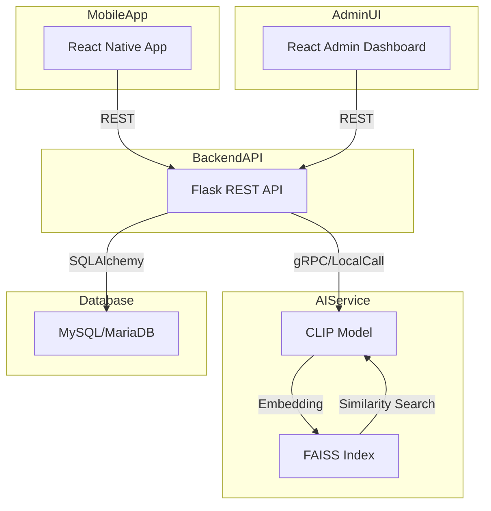

---

### 4.2 Component Breakdown

This section details the responsibilities and interactions of each major component. Understanding these roles is essential for both development and troubleshooting, as it clarifies which part of the system is responsible for which functionality.

#### Mobile App (React Native/Expo)
- **Why React Native?**  
  - Write once, run on iOS, Android, and Web.
  - Fast reload, large community, easy integration with native modules.
- **Expo**: Simplifies build, OTA updates, camera/barcode APIs.

#### Admin Dashboard (React + Ant Design)
- **Why React?**  
  - Component-based, fast, easy to maintain.
- **Ant Design**: Enterprise-grade UI, ready-made tables, charts, forms.

#### Backend API (Flask + SQLAlchemy)
- **Why Flask?**  
  - Lightweight, flexible, easy to extend.
  - Good for microservices and monoliths.
- **SQLAlchemy**: ORM for Python, supports migrations, relationships.

#### AI Service (PyTorch + CLIP + FAISS)
- **Why PyTorch?**  
  - Research-friendly, dynamic computation graphs.
- **CLIP**: State-of-the-art for image-text similarity.
- **FAISS**: Efficient, scalable vector search (100k+ covers).

#### Database (MySQL/MariaDB)
- **Why MySQL?**  
  - ACID, mature, easy to scale, strong ecosystem.
- **MariaDB**: Drop-in replacement, open source.

---

### 4.3 Data Flow

To understand how a typical user action propagates through the system, the following sequence diagram illustrates the flow from a user scanning a book to the retrieval of book details. This diagram serves as a bridge between the component breakdown and the specific flows (like authentication and error handling) that follow.

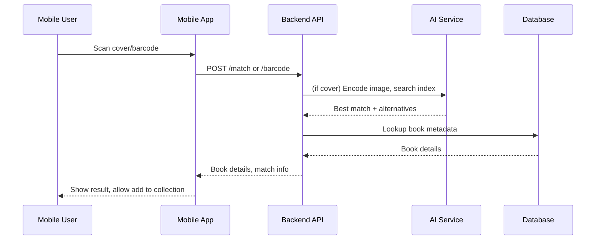

---

### 4.4 User Authentication Flow

Authentication is a critical part of the system, ensuring that only authorized users can access certain features. The flowchart below details the steps involved in authenticating a user, from app launch to making authenticated API requests. This process is designed to be secure and user-friendly.

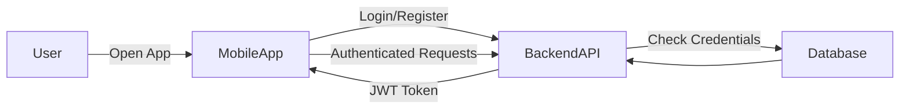

---

### 4.5 Error Handling Flow

Robust error handling is essential for a reliable user experience. The following flowchart shows how the backend processes errors, including validation, retries, and user feedback. This ensures that users receive meaningful feedback and that the system can recover gracefully from transient issues.

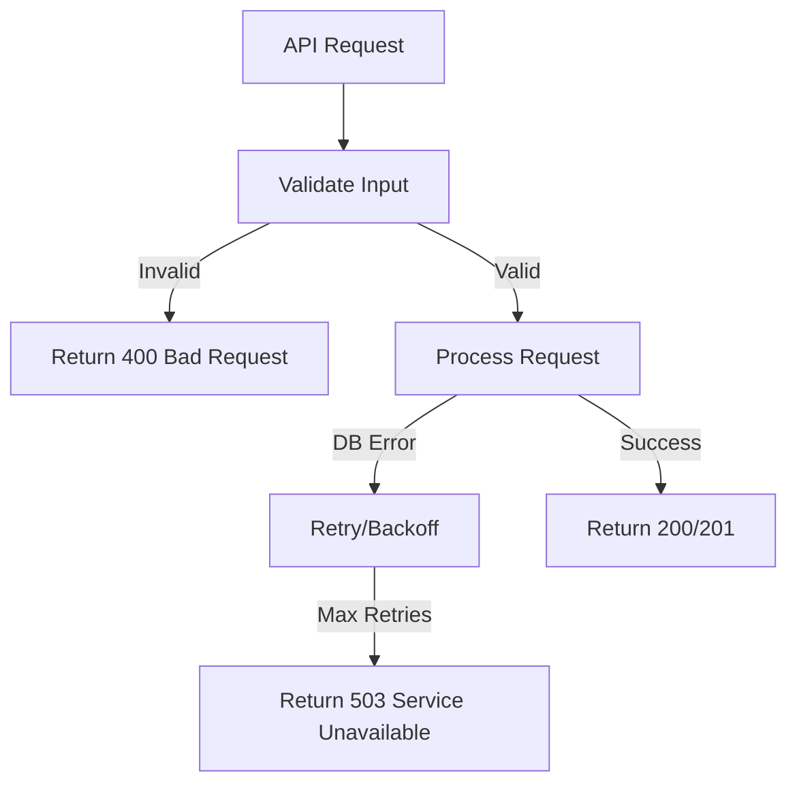

---

## 5. Data Model & Database Design

The data model is the backbone of the Ridizi platform, defining how information is stored, related, and accessed. This section covers the main entities, their relationships, and the rationale for the chosen schema. Proper database design ensures efficient queries, data integrity, and support for analytics.

### 5.1 Entity-Relationship Diagram

The ER diagram below provides a visual summary of the main entities and their relationships. This is referenced throughout the API and backend sections and is essential for understanding how data is structured and accessed.

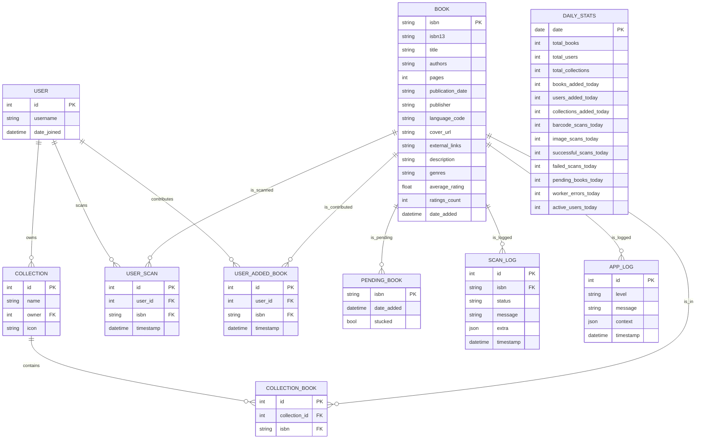

---

### 5.2 Table Definitions

Each table in the database is described in detail here, with fields, types, and explanations. This section is essential for understanding how data is stored and accessed, and for planning migrations or schema changes.

#### Book Table

| Field            | Type         | Description                        |
|------------------|--------------|------------------------------------|
| isbn             | VARCHAR(13)  | Primary key (ISBN-10)              |
| isbn13           | VARCHAR(13)  | ISBN-13                            |
| title            | TEXT         | Book title                         |
| authors          | JSON/TEXT    | List of authors                    |
| pages            | INT          | Number of pages                    |
| publication_date | VARCHAR(20)  | Publication date                   |
| publisher        | TEXT         | Publisher name                     |
| language_code    | VARCHAR(10)  | ISO language code                  |
| cover_url        | TEXT         | URL to cover image                 |
| external_links   | JSON/TEXT    | Links to Goodreads, Amazon, etc.   |
| description      | TEXT         | Book description                   |
| genres           | JSON/TEXT    | List of genres                     |
| average_rating   | FLOAT        | Average user rating                |
| ratings_count    | INT          | Number of ratings                  |
| date_added       | DATETIME     | When added to DB                   |

#### User Table

| Field        | Type         | Description         |
|--------------|--------------|---------------------|
| id           | INT PK       | User ID             |
| username     | VARCHAR(50)  | Unique username     |
| date_joined  | DATETIME     | Registration date   |

#### Collection Table

| Field        | Type         | Description         |
|--------------|--------------|---------------------|
| id           | INT PK       | Collection ID       |
| name         | VARCHAR(100) | Collection name     |
| owner        | INT FK       | User ID             |
| icon         | VARCHAR(10)  | Emoji/icon          |

#### CollectionBook Table

| Field          | Type         | Description         |
|----------------|--------------|---------------------|
| id             | INT PK       | Row ID              |
| collection_id  | INT FK       | Collection ID       |
| isbn           | VARCHAR(13)  | Book ISBN           |

#### UserScan Table

| Field        | Type         | Description         |
|--------------|--------------|---------------------|
| id           | INT PK       | Row ID              |
| user_id      | INT FK       | User ID             |
| isbn         | VARCHAR(13)  | Book ISBN           |
| timestamp    | DATETIME     | Scan time           |

#### PendingBook Table

| Field        | Type         | Description         |
|--------------|--------------|---------------------|
| isbn         | VARCHAR(13)  | Book ISBN           |
| date_added   | DATETIME     | When added to queue |
| stucked      | BOOL         | Worker error flag   |

#### ScanLog & AppLog

- **ScanLog**: All scan attempts (cover/barcode), status, user, extra context.
- **AppLog**: All significant events, errors, warnings.

#### DailyStats

- Precomputed analytics for dashboard (books, users, scans, etc.)

---

### 5.3 Indexing & Performance

Efficient indexing is crucial for performance, especially as the dataset grows. This section explains the indexing strategy and why SQL was chosen over NoSQL for this project. It also discusses how indexes are maintained and how they impact query performance.

- **Indexes**:  
  - Primary keys on all tables.
  - Indexes on `isbn`, `isbn13`, `username`, `collection_id`, `user_id`.
- **Why not NoSQL?**  
  - Data is highly relational (users, collections, books).
  - SQL joins are efficient for analytics and reporting.
- **Partitioning**:  
  - Not needed at current scale, but can be added for `scan_logs` if volume grows.

---

### 5.4 Collection CRUD Sequence

The following sequence diagram illustrates the typical flow for creating, updating, and deleting collections. This helps clarify how the frontend, backend, and database interact during these operations, and highlights the importance of transactional integrity.

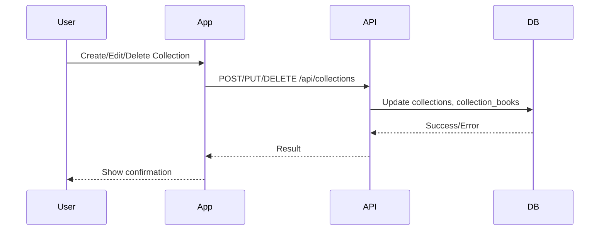

---

## 6. API Design

The API layer is the interface between the frontend applications and the backend services. This section outlines the principles guiding the API design, lists all endpoints, and provides examples to help developers integrate with the system. Consistent API design is key for maintainability and ease of use.

### 6.1 RESTful Principles

RESTful design ensures consistency and predictability in the API. This section explains the conventions used and why REST was chosen over alternatives like GraphQL. REST’s statelessness and resource orientation make it a good fit for Ridizi’s needs.

- **Resource-oriented**: `/api/book/<isbn>`, `/api/collections/<username>`
- **Stateless**: Each request contains all necessary info.
- **Versioned**: All endpoints under `/api/v1/` (future-proofing).
- **Consistent error handling**: JSON errors, HTTP status codes.

---

### 6.2 Endpoint Reference

A comprehensive table of all API endpoints, their methods, and purposes. This serves as a quick reference for developers and integrators.

| Path                                      | Method | Description                                 | Auth      |
|--------------------------------------------|--------|---------------------------------------------|-----------|
| `/api/book/<isbn>`                        | GET    | Get book details by ISBN                    | Public    |
| `/api/search`                             | GET    | Search books by title/author/isbn/genre     | Public    |
| `/api/users`                              | POST   | Create new user                             | Public    |
| `/api/users`                              | GET    | List all users                              | Admin     |
| `/api/user_scans`                         | POST   | Add scan record                             | Public    |
| `/api/user_scans/<username>`              | DELETE | Delete all scans for user                   | User      |
| `/api/recently_scanned/<username>`        | GET    | Get user's scan history                     | User      |
| `/api/collections/<username>`             | GET    | Get all collections for user                | User      |
| `/api/collections/<username>`             | POST   | Create new collection                       | User      |
| `/api/collections/<username>/<id>/add`    | POST   | Add book to collection                      | User      |
| `/api/collections/<id>/books`             | GET    | Get books in collection                     | User      |
| `/api/collections/<id>/books/<isbn>`      | DELETE | Remove book from collection                 | User      |
| `/api/collections/<username>/<id>`        | PUT    | Update collection name/icon                 | User      |
| `/api/collections/<username>/<id>`        | DELETE | Delete collection                           | User      |
| `/match`                                  | POST   | Match cover image to book                   | Public    |
| `/barcode`                                | POST   | Scan barcode (ISBN)                         | Public    |
| `/cover/<filename>`                       | GET    | Serve cover image                           | Public    |
| `/admin/api/stats`                        | GET    | Get system statistics                       | Admin     |
| `/admin/api/activity`                     | GET    | Get 7-day activity overview                 | Admin     |
| `/admin/api/daily-stats`                  | GET    | Get detailed daily stats                    | Admin     |
| `/admin/api/logs`                         | GET    | Get recent logs                             | Admin     |
| `/admin/api/workers/status`               | GET    | Get worker status                           | Admin     |
| `/admin/api/workers/<id>/start`           | POST   | Start worker process                        | Admin     |
| `/admin/api/workers/<id>/stop`            | POST   | Stop worker process                         | Admin     |
| `/admin/api/analytics/*`                  | GET    | Analytics endpoints                         | Admin     |
| `/admin/api/testing/*`                    | GET    | Manual testing tools                        | Admin     |

---

### 6.3 Example Requests & Responses

Concrete examples of API usage, showing both requests and expected responses. These examples help developers understand how to interact with the API and what to expect in return.

#### Book Search

**Request:**
```http
GET /api/search?q=harry+potter
```

**Response:**
```json
[
  {
    "isbn": "0439708184",
    "isbn13": "9780439708180",
    "title": "Harry Potter and the Sorcerer's Stone",
    "authors": ["J.K. Rowling"],
    "cover_url": "https://covers.openlibrary.org/b/isbn/0439708184-L.jpg",
    "genres": ["Fantasy", "Young Adult"]
  }
]
```

#### Cover Match

**Request:**
```http
POST /match
Content-Type: multipart/form-data

image: (file)
username: "alice"
```

**Response:**
```json
{
  "filename": "0439708184.jpg",
  "score": 0.0123,
  "title": "Harry Potter and the Sorcerer's Stone",
  "authors": ["J.K. Rowling"],
  "cover_url": "/cover/0439708184.jpg",
  "alternatives": [
    { "filename": "...", "score": 0.034, ... }
  ],
  "username": "alice"
}
```

---

### 6.4 Error Handling

Error handling is standardized across the API. The following flow diagram shows how errors are detected and reported back to the client. This ensures that clients can handle errors gracefully and that issues can be diagnosed quickly.

- **Validation**: 400 for bad requests
- **Authentication**: 401/403 for unauthorized
- **Not Found**: 404 for missing resources
- **Conflict**: 409 for duplicates
- **Server Error**: 500 for unexpected errors
- **Retry Mechanisms**: Exponential backoff for DB operations

**Example:**
```json
{ "error": "No isbn provided" }
```

---

### 6.5 API Request/Response Flow

This flowchart summarizes the lifecycle of an API request, from client to backend and back. It highlights the main steps and decision points in processing a request.

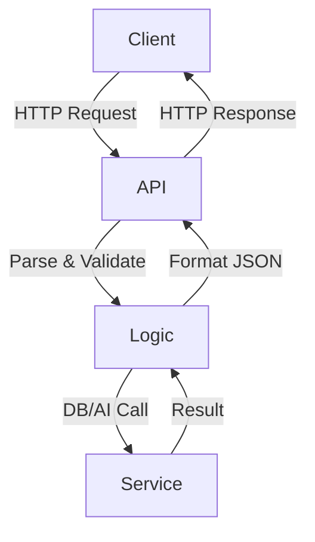

---

## 7. AI & Image Matching

AI-powered image matching is a core feature of Ridizi, enabling users to identify books by scanning their covers. This section explains the AI models and indexing strategies used, as well as the workflow for processing and matching images. The design ensures fast, accurate, and scalable image recognition.

### 7.1 Model Selection

Here we explain why CLIP and FAISS were chosen, with a brief comparison to alternatives. The decision was based on accuracy, scalability, and ease of integration with the rest of the stack.

- **CLIP (ViT-B/32)**:  
  - Chosen for its ability to embed images and text in the same space.
  - Outperforms traditional CNNs for open-set recognition.
  - PyTorch implementation is well-supported.
- **Alternatives considered**:  
  - ResNet + custom classifier (less flexible, lower accuracy).
  - Google Vision API (cost, privacy, latency).
  - OpenAI API (cost, privacy, rate limits).

### 7.2 Embedding & Indexing

This section details how images are processed and indexed for fast similarity search. The process is designed to be efficient and scalable, supporting both batch and incremental updates.

- **FAISS**:  
  - Efficient similarity search for high-dimensional vectors.
  - Scales to 100k+ covers on commodity hardware.
  - Supports L2 and cosine similarity.
- **Indexing workflow**:
  - Encode all covers with CLIP.
  - Store embeddings in `image_features.npy`.
  - Store filenames in `image_names.json`.
  - Build FAISS index (`index.faiss`).

**Sample:**
```python
from transformers import CLIPProcessor, CLIPModel
import torch
from PIL import Image

model = CLIPModel.from_pretrained("openai/clip-vit-base-patch32")
processor = CLIPProcessor.from_pretrained("openai/clip-vit-base-patch32")

image = Image.open("cover.jpg").convert("RGB").resize((224, 224))
inputs = processor(images=image, return_tensors="pt")
with torch.no_grad():
    outputs = model(**inputs)
    embedding = outputs.image_embeds[0].cpu().numpy()
```

### 7.3 Matching Workflow

A step-by-step explanation of how a cover scan is processed, from image upload to match result. This workflow is central to the user experience and is optimized for speed and accuracy.

1. User uploads cover image via mobile app.
2. Image is resized and encoded by CLIP.
3. Embedding is searched in FAISS index for top 6 matches.
4. Best match and alternatives returned with metadata.
5. All attempts are logged for analytics.

### 7.4 Performance & Scaling

Discussion of performance benchmarks and scaling strategies. This section explains how the system can handle increasing loads and larger datasets.

- **CPU**: ~100ms per query for 100k covers.
- **GPU**: <30ms per query.
- **Batch updates**: New covers can be added incrementally.
- **Why not Annoy/HNSWlib?**  
  - FAISS is more mature, better for large-scale, supports GPU.

---

### 7.5 Cover Scan Sequence

The following sequence diagram shows the detailed steps involved in scanning a book cover and retrieving matches. This diagram is useful for both developers and testers.

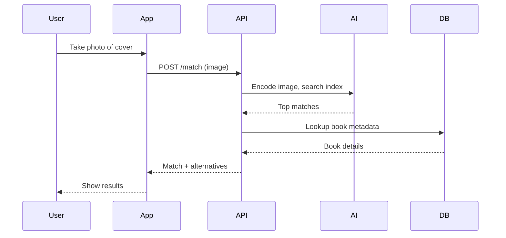

---

## 8. Data Processing & ETL

Data processing and ETL (Extract, Transform, Load) pipelines are essential for keeping the Ridizi database up-to-date and enriched. This section describes how raw data is imported, cleaned, and transformed into usable information, as well as how cover images and AI indexes are managed.

### 8.1 Metadata Import

This subsection explains the process of importing book metadata from external sources. The system uses scripts to parse CSV files, enrich data with external APIs, and load the results into the database. This ensures that the book catalog is comprehensive and accurate.

- **Source**: CSV (books.csv) → JSON (metadata.json)
- **Tools**: Pandas for parsing, cleaning, and transformation
- **Enrichment**: OpenLibrary, Google Books APIs for missing fields
- **Batch Import**: `import_metadata_to_db.py` loads JSON into DB

**Sample:**
```python
import pandas as pd
df = pd.read_csv("books.csv")
df["authors"] = df["authors"].apply(lambda x: x.split("/") if isinstance(x, str) else [])
# ...build metadata dict...
```

### 8.2 Cover Download

How cover images are fetched and stored. This step is crucial for enabling image-based search and recognition.

- **Source**: OpenLibrary cover API
- **Parallelization**: ThreadPoolExecutor for concurrent downloads
- **Storage**: `/data/covers/{isbn}.jpg`

### 8.3 Index Building

How the FAISS index is built and updated. This process is optimized for speed and reliability, ensuring that new covers are searchable as soon as they are added.

- **Script**: `build_index.py`
- **Process**: Encode all covers, build FAISS index, save features/names
- **Incremental Update**: `add_to_index(isbn)` for new covers

### 8.4 ETL Flow

The following flowchart summarizes the entire ETL process, showing how data moves from raw CSV to a fully indexed and enriched database. This diagram helps clarify the dependencies and order of operations in the data pipeline.

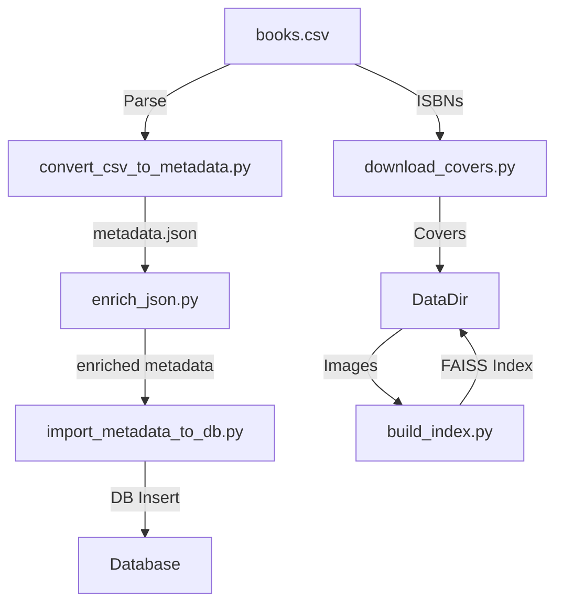

---

## 9. Security & Compliance

Security and compliance are foundational to Ridizi. This section explains authentication, data privacy, rate limiting, and incident response, with diagrams to clarify the flow of sensitive operations. Security is considered at every layer of the system.

### 9.1 Authentication & Authorization

How users and admins are authenticated and authorized. This section explains the mechanisms in place to protect user data and system integrity.

- **JWT**: Planned for user endpoints
- **API Keys**: For admin endpoints
- **Role-based Access**: User, admin, moderator

### 9.2 Data Privacy & GDPR

How the system ensures compliance with data privacy regulations. This includes data minimization, user consent, and the ability to export or delete user data.

- **GDPR Compliance**: Data export/delete, consent management
- **Encryption**: TLS for all network traffic
- **Data Minimization**: Only necessary data stored

### 9.3 Rate Limiting & Abuse Prevention

How the system protects itself from abuse and denial-of-service attacks. Rate limiting is implemented at the API level to ensure fair usage.

- **API Rate Limits**: Per-user and per-IP (planned)
- **Abuse Detection**: Monitor for suspicious activity

### 9.4 Security Incident Flow

The following flowchart shows the steps taken when a security incident is detected, from detection to resolution. This process ensures that incidents are handled quickly and transparently.

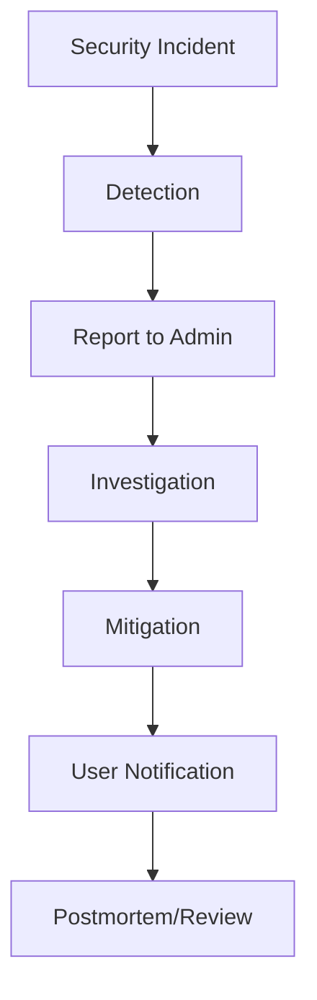

---

## 10. Scalability & Performance

This section discusses how the system is designed to scale, including worker processes and asynchronous job handling. The worker process flow diagram illustrates how background tasks are managed and how the system can handle increasing loads.

### 10.1 Worker Process Flow

The following diagram shows how pending jobs are processed by workers and how results are integrated back into the system. This is essential for maintaining performance as the dataset grows.

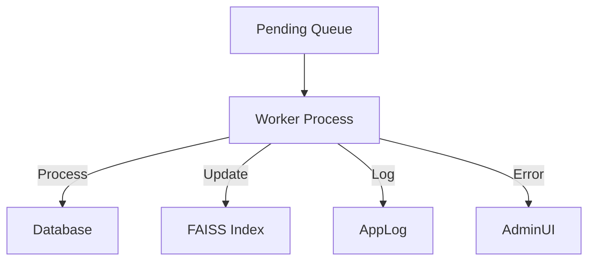

---

## 11. Testing & Quality Assurance

Testing is critical for reliability. This section explains the test strategy and includes a flow diagram for test execution, showing how automated and manual tests are run and reported. Quality assurance is integrated into the development process.

### 11.1 Test Execution Flow

The following flowchart summarizes the process of running tests and reporting results. This ensures that all features are validated before deployment.

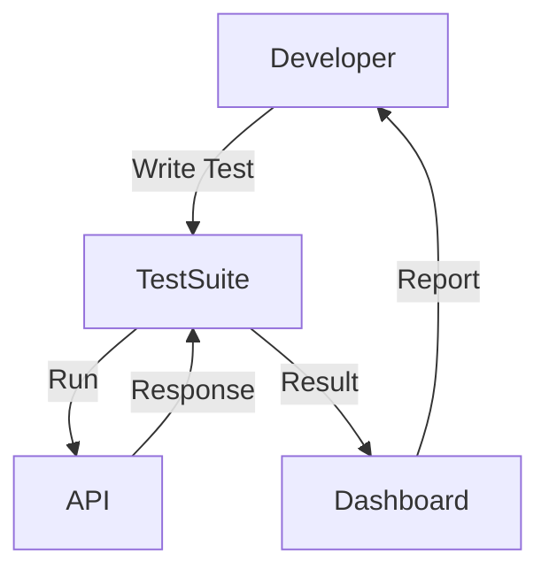

---

## 12. Configuration & Environment

This section details the configuration files, environment variables, and settings required to run the system. It provides context for developers setting up or maintaining the project, and explains how to manage secrets and environment-specific settings.

### 12.1 Environment Variables

| Variable      | Description                  |
|---------------|-----------------------------|
| DB_USER       | Database username           |
| DB_PASS       | Database password           |
| DB_HOST       | Database host               |
| DB_PORT       | Database port               |
| DB_NAME       | Database name               |
| ...           | (Other secrets as needed)   |

### 12.2 Settings Files

- `.env`: Secrets and config for backend
- `config/api.ts`: API base URL for frontend

---

## 13. Maintenance & Extensibility

Here we discuss how the system is designed for long-term maintenance and future extension, including modularity, versioning, and documentation practices. This ensures that the platform can evolve as requirements change.

- **Modular Codebase**: Each component is independently upgradable
- **API Versioning**: Future-proof for breaking changes
- **Scripted Migrations**: Alembic or custom scripts for DB schema changes
- **Plugin Support**: (Planned) For new AI models, data sources
- **Documentation**: All scripts and endpoints are documented inline

---

## 14. How CLIP and FAISS Work

This section provides a detailed explanation of the two core AI technologies powering Ridizi's image matching: CLIP and FAISS. Understanding their inner workings is essential for both developers and maintainers, as these components are central to the platform's book cover recognition capabilities.

### 14.1 CLIP (Contrastive Language–Image Pre-training)

CLIP is a neural network model developed by OpenAI that learns visual concepts from natural language supervision. It is designed to embed both images and text into a shared vector space, enabling powerful cross-modal search and matching.

**How CLIP Works:**

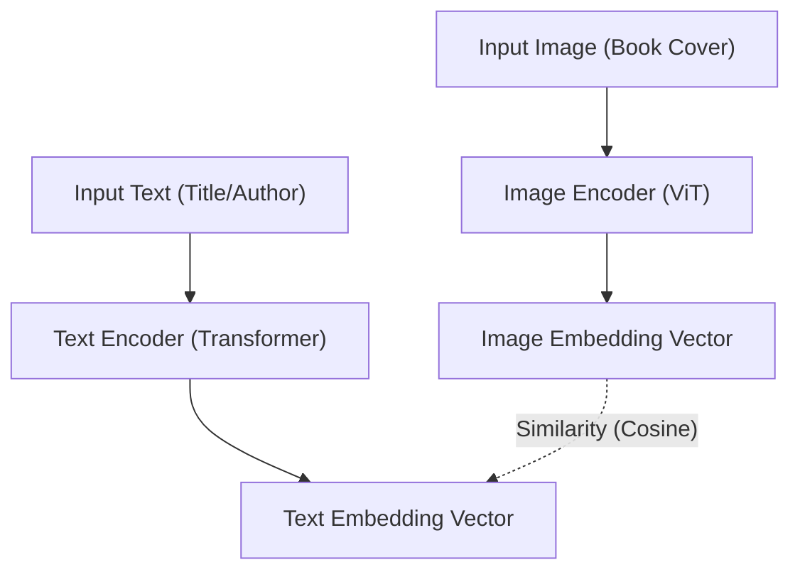

- **Architecture:** CLIP consists of two encoders: an image encoder (typically a Vision Transformer, ViT) and a text encoder (usually a Transformer-based model).
- **Training:** CLIP is trained on a large dataset of (image, text) pairs. The model learns to maximize the similarity between the image and its corresponding text, while minimizing similarity to unrelated pairs. This is achieved using a contrastive loss.
- **Embedding:** At inference time, an image (e.g., a book cover) is passed through the image encoder to produce a fixed-length vector (embedding). Similarly, text can be encoded into the same vector space.
- **Similarity:** The cosine similarity (or dot product) between vectors is used to measure how closely an image matches a text description, or, in Ridizi's case, how similar two images are.

**Why CLIP?**
- **Generalization:** CLIP can recognize a wide variety of visual concepts, even those not seen during training.
- **Zero-shot:** It can match images to text or other images without task-specific fine-tuning.
- **Performance:** CLIP embeddings are robust for open-set recognition, making it ideal for matching book covers with high variability.

**Example:**
```python
from transformers import CLIPProcessor, CLIPModel
import torch
from PIL import Image

model = CLIPModel.from_pretrained("openai/clip-vit-base-patch32")
processor = CLIPProcessor.from_pretrained("openai/clip-vit-base-patch32")

image = Image.open("cover.jpg").convert("RGB").resize((224, 224))
inputs = processor(images=image, return_tensors="pt")
with torch.no_grad():
    outputs = model(**inputs)
    embedding = outputs.image_embeds[0].cpu().numpy()
```
This embedding can then be compared to other embeddings using cosine similarity.

---

### 14.2 FAISS (Facebook AI Similarity Search)

FAISS is a library developed by Facebook AI Research for efficient similarity search and clustering of dense vectors. It is optimized for high-dimensional data and large-scale datasets, making it a perfect fit for searching among thousands of book cover embeddings.

**How FAISS Works:**

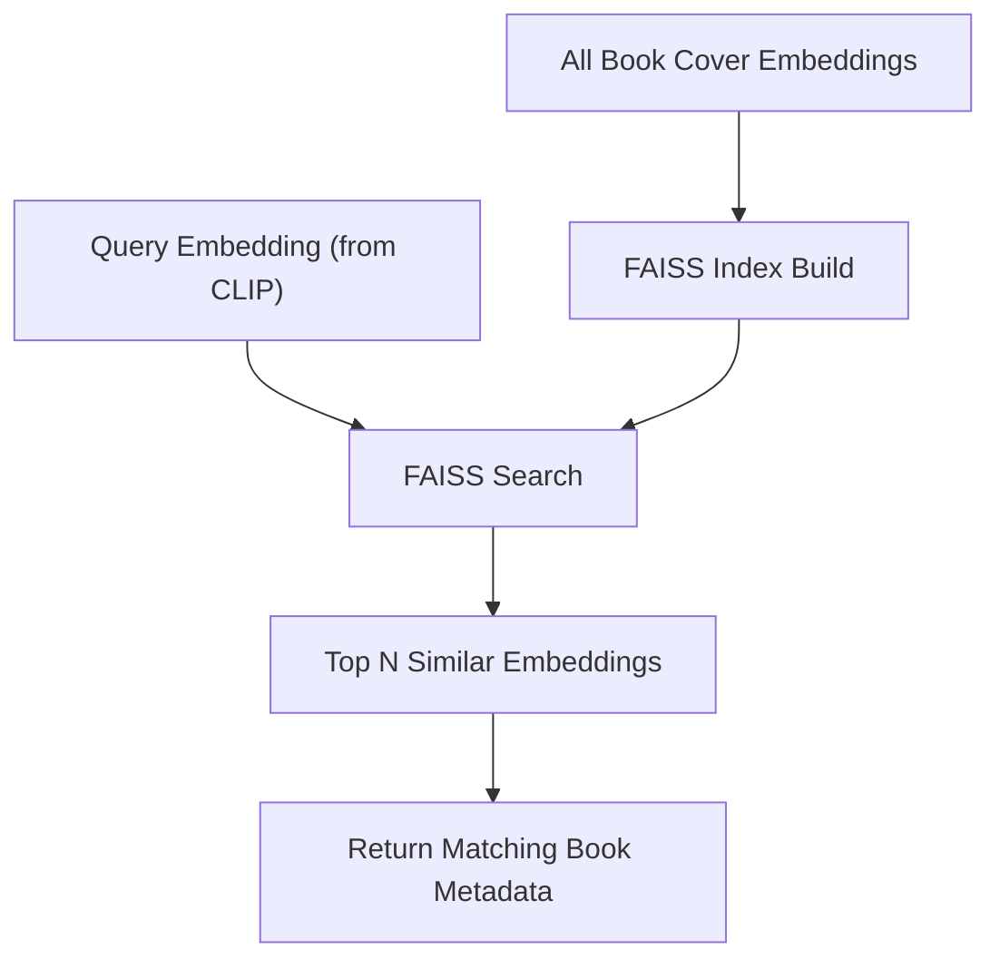

- **Indexing:** FAISS builds an index of all vectors (embeddings) in the dataset. Several index types are available, such as flat (brute-force), IVF (inverted file), and HNSW (hierarchical navigable small world graphs), each with different trade-offs between speed, memory, and accuracy.
- **Search:** When a query vector (e.g., a new cover embedding) is provided, FAISS efficiently finds the nearest neighbors (most similar vectors) in the index using L2 (Euclidean) or cosine distance.
- **Batch Processing:** FAISS supports batch queries and can run on both CPU and GPU, enabling fast searches even with large datasets (100k+ covers).
- **Persistence:** The index can be saved to disk and reloaded, allowing for incremental updates and fast startup.

**Why FAISS?**
- **Scalability:** Handles large datasets efficiently, with sub-linear search times.
- **Flexibility:** Supports multiple distance metrics and index types.
- **Integration:** Works seamlessly with NumPy arrays and PyTorch tensors.

**Example:**
```python
import faiss
import numpy as np

# Assume features is a (N, D) numpy array of CLIP embeddings
features = np.load("image_features.npy").astype("float32")
index = faiss.IndexFlatL2(features.shape[1])  # L2 distance

# Add all embeddings to the index
index.add(features)

# Query: find top 5 nearest neighbors for a new embedding
D, I = index.search(np.expand_dims(query_embedding, axis=0), 5)
# I contains indices of the closest matches
```

**Integration in Ridizi:**

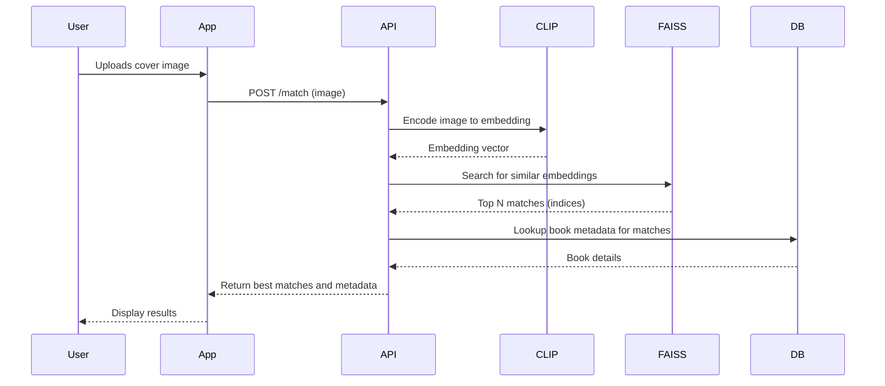

- All book covers are encoded with CLIP and stored as vectors.
- These vectors are indexed by FAISS for fast similarity search.
- When a user scans a cover, its embedding is computed and FAISS returns the closest matches, which are then mapped back to book metadata.

---

## 15. – End Matter

### 15.1 – Project Owner


<div>
  
  <p><strong>Pierre GORIN</strong></p>
  <p>Founder of Ridizi</p>
  <p>
    <a href="https://github.com/Pierre2103" target="_blank">GitHub</a> |
    <a href="https://www.linkedin.com/in/pierre-gorin-61a784221/" target="_blank">LinkedIn</a>
  </p>
</div>

---

### 15.2 – License

This project is licensed under the MIT License – see the [LICENSE](../LICENSE.md) file for details.

---

# 15.3 Glossary

A glossary of key terms and acronyms used throughout the document, to ensure clarity and shared understanding. This is especially useful for onboarding new team members and for cross-functional collaboration.

| Term         | Definition                                                                 |
|--------------|----------------------------------------------------------------------------|
| **CLIP**     | Contrastive Language–Image Pre-training, an AI model for image-text similarity |
| **FAISS**    | Facebook AI Similarity Search, a library for efficient similarity search   |
| **ISBN**     | International Standard Book Number, unique identifier for books            |
| **GDPR**     | General Data Protection Regulation, EU regulation for data privacy         |
| **JWT**      | JSON Web Token, used for authentication                                   |
| **CRUD**     | Create, Read, Update, Delete operations                                   |
| **ORM**      | Object-Relational Mapping, e.g., SQLAlchemy                               |
| **Pending Queue** | List of books awaiting processing/approval                           |
| **Worker**   | Background process for async tasks (e.g., metadata fetching, index build)  |

---

## 15.4 References

A list of resources, libraries, and documentation referenced in this specification. These references provide additional context and support for the design decisions made in the project.

- [OpenAI CLIP](https://github.com/openai/CLIP)
- [FAISS](https://github.com/facebookresearch/faiss)
- [OpenLibrary API](https://openlibrary.org/developers/api)
- [Google Books API](https://developers.google.com/books)
- [GDPR](https://gdpr.eu/)
- [React Native](https://reactnative.dev/)
- [Flask](https://flask.palletsprojects.com/)
- [SQLAlchemy](https://www.sqlalchemy.org/)
- [Docker](https://www.docker.com/)
- [Ant Design](https://ant.design/)